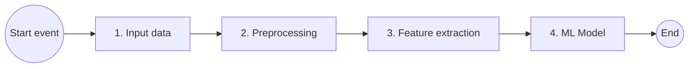
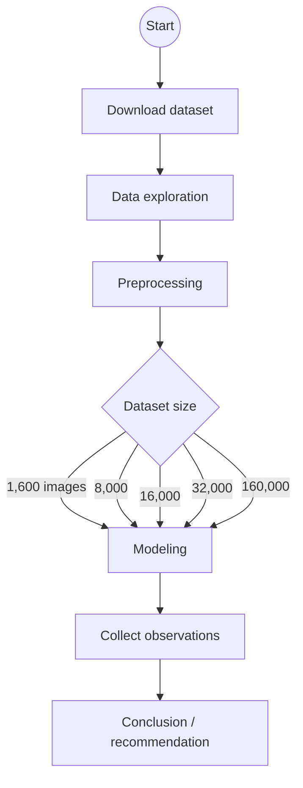
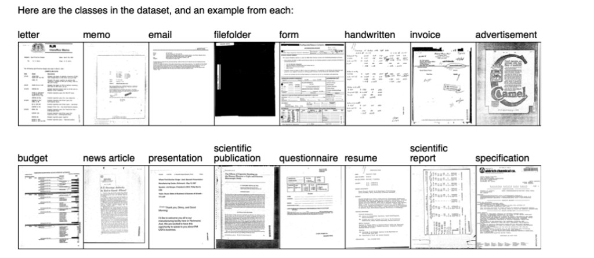
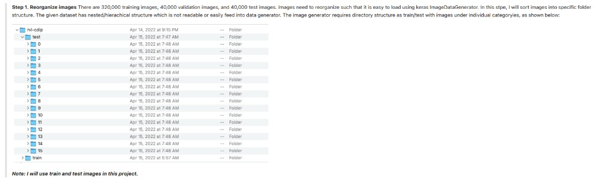

# Document Image Classification - Multiclass classifier

**Course:** CSCI E-25  
**Assignment:** Project proposal  
**Author:** Kamal Dalal

## Introduction

Content-based analysis of document images has a number of applications. The economic feasibility of creating a large database of document images has left a tremendous need for robust ways to access the information. Printed documents are scanned for archiving or in an attempt to move towards a paperless office and are stored as images. In digital libraries, documents are often stored as images before they are processed by text extraction tools. Documents play a pivotal role in all of the fields of business communication and record-keeping.

Document classification is an age-old problem in information retrieval, and it plays an important role in a variety of applications for effectively managing text and large volumes of unstructured information. **Automatic document classification** can be defined as **content-based** assignment of one or more predefined categories (topics) to documents. This makes it easier to find the relevant information at the right time and for filtering and routing documents directly to users. Automatic document classification applies machine learning or other technologies to automatically classify documents; this results in faster, more scalable, and more objective classification.

## Objective

Build a model to classify an input document image as one of the predefined categories.

The approach is **supervised learning**: the classifier is trained on **pre-labeled** document images and predicts a category for each new image. A **publicly available** dataset will be used to **train** and **test** the model.

## Computer vision pipeline

The following diagram shows the high-level methodology used to address the problem statement: RVL-CDIP images are ingested, preprocessed, passed through feature extraction, and classified by a multiclass model into one of sixteen document categories.



## Structure of the notebook

As in the workflow figure, the project starts from a **publicly available** dataset. The notebook **explores** the corpus, then applies **preprocessing** before any model design. Because of **compute and memory** limits, experiments use **smaller, sampled subsets** to build and validate models before scaling up.

The main **Colab / Jupyter** path is linear, with branches for **how much training data** is used and **which architecture** is trained.



**Preprocessing** (detail for the stage above):

- **Reorganize images** — place files in a consistent folder layout (e.g., by class or split).
- **Resize images** — standardize resolution for the model (see the **Preprocessing** section).
- **Reformat** — convert **.tif** to **.png** for smaller Drive footprint and **Keras** pre-trained pipelines (see **Preprocessing**, Step 3).

**Dataset size (iterative):** experiments sweep how many **training** images are sampled **per category**—**100**, **500**, **1,000**, **2,000**, and **10,000**. With **16** classes, that is **1,600**, **8,000**, **16,000**, **32,000**, and **160,000** **training** images in total, matching the branches in the diagram. The same **generate_dataset**-style pipeline builds each regime; to avoid repeating long sections, the **notebook** walks through **only three** of these sizes as **demonstrations** (the procedure is identical for the rest).

**Example — “Dataset 16,000”:** **1,000** images **per category** for **training** and **200** **per category** for a **held-out evaluation** split sampled from the reorganized **`test`** tree (**3,200** images total = 200 × 16). (If you instead reserve **200** **per category** strictly for **validation** during training, use the same sampling pattern on a `validation/` tree or a carved subset.) The run name follows total **training** images: 16 × 1,000 = **16,000**. Exported tiles for this run are **1000 × 768** pixels (other experiments may use **512 × 512**, as in **Preprocessing**).

**Observed pool sizes (example machine):** under **`/Volumes/T7/rvl-cdip/train/<class>/`**, each class folder holds on the order of **~19.8k–20.1k** TIFFs (consistent with **~20k** train images per class in RVL-CDIP). `generate_dataset` logs one line per directory, e.g. `Directory .../train/15 has 19975 files, we have to choose 1000 files (randomly).` — then it writes **1,000** random **PNG**s per class. Under **`.../rvl-cdip/test/<class>/`**, pools are **~2.4k–2.6k** TIFFs per class (about **2,500** on average, matching **40k** test ÷ **16**), with log lines such as `Directory .../test/3 has 2532 files, we have to choose 200 files (randomly).` That pass writes **200** random **PNG**s per class (**3,200** total).

**Models** (three runs per data configuration):

1. **Convolutional neural network (CNN)** — custom or from-scratch baseline.
2. **Transfer learning** with **EfficientNetB0**.
3. **Transfer learning** with **ResNet50**.

Each model is trained and evaluated on the same **train / validation / test** layout for that subset. After every run, the notebook records **training accuracy**, **validation accuracy**, **training loss**, **validation loss**, **execution time**, **number of epochs**, and related settings. **Collect observations** aggregates these runs; the final **conclusion** compares models and recommends a preferred setup from the metrics.

**Train / validation / test (per experimental dataset):**

- Splits use an **80% / 20%** ratio between **(training + validation)** combined and **held-out test**—i.e. **20%** of the images in that experimental bundle are reserved for **test**.
- Configurations are **named by the training-set size** **T** (the count of images used for weight updates).
- **Validation** uses **20% of T** additional images (**not** overlapping the **T** training images), drawn from the same balanced sampling process, for early stopping / monitoring.

Equivalently, if **T** is the training count, **validation** holds **0.2·T** images and **test** holds **0.3·T** images so that **T + 0.2T + 0.3T** is the full experimental subset and **(T + 0.2T) : 0.3T = 80 : 20**.

## Download dataset

This project uses **RVL-CDIP** (*Ryerson Vision Lab Complex Document Information Processing*): scanned **grayscale** document images in **16** classes (e.g., letter, form, email, resume, memo, and others in the table below). The release is **public**; the archive is typically named **`rvl-cdip.tar.gz`**, about **37 GB** compressed. Uncompressed on disk, the corpus is on the order of **~100 GB**.

The full split is fixed in the source distribution: **320,000** training, **40,000** validation, and **40,000** test images (often described as **train / validation / test** or **train / dev / test**). **Note:** all images are **grayscale**.

**Reference:** A. W. Harley, A. Ufkes, K. G. Derpanis, *Evaluation of Deep Convolutional Nets for Document Image Classification and Retrieval,* ICDAR, 2015 — [https://www.cs.cmu.edu/~aharley/icdar15](https://www.cs.cmu.edu/~aharley/icdar15)

## Dataset

The **RVL-CDIP** dataset contains **400,000** images in **16** balanced classes (**25,000** per class). Official splits: **320k / 40k / 40k** for train, validation, and test. Image dimensions vary; the largest side is capped around **1000** pixels in the release.

The compressed archive (**~37 GB**, `rvl-cdip.tar.gz`) unpacks to a tree summarized below. Class IDs **0–15** follow this order:

| ID | Category |
|----|----------|
| 0 | letter |
| 1 | form |
| 2 | email |
| 3 | handwritten |
| 4 | advertisement |
| 5 | scientific report |
| 6 | scientific publication |
| 7 | specification |
| 8 | file folder |
| 9 | news article |
| 10 | budget |
| 11 | invoice |
| 12 | presentation |
| 13 | questionnaire |
| 14 | resume |
| 15 | memo |

After extracting `rvl-cdip.tar.gz`, the top-level folder **`rvl-cdip`** contains dataset notes, label files for each split, and all images. The **`labels`** directory holds `train.txt`, `val.txt`, and `test.txt`; each line is an image name (or path) and a category ID, **space-separated**. Image files live under **`images/`** (paths match the label files).

```text
rvl-cdip/
├── readme.txt
├── labels/
│   ├── train.txt
│   ├── val.txt
│   └── test.txt
└── images/
    └── ...            # grayscale document images
```

## Data exploration

In this step the notebook **inspects** the release to understand the **images** and **labels** before preprocessing. The official split sizes are **320,000** training, **40,000** validation, and **40,000** test images (as in **Download dataset**). Images are **grayscale** scans whose **largest dimension does not exceed 1000** pixels (exact width/height varies by page).

Representative **one-image-per-category** thumbnails illustrate how layout, typography, and structure differ across classes (grid order is for display only; canonical **0–15** IDs are in the **Dataset** table):



**Label files** under `labels/` (`train.txt`, `val.txt`, `test.txt`) list one sample per line:

```text
path/to/the/image.tif 3
```

Each line is **`path/to/the/image.tif`** (path relative to the dataset root or `images/`, depending on the release), then a **separator**, then the **integer category** **0–15**. (Some mirrors use multiple spaces or tabs; split on whitespace and take the last token as the class ID.)

Categories are integers **0** through **15** in the fixed order **letter → form → email → … → memo** (full table in **Dataset** above).

*(If you list classes **1–16** in prose, subtract one to match the ID in the label files.)*

## Input data

The **RVL-CDIP** release provides a large number of images for training, validation, and testing. Working with the full corpus needs substantial compute, RAM, and disk space: the archive is about **37 GB** compressed, and roughly **~100 GB** on disk after extraction. As in the layout above, pixel data lives under **`images/`**, while splits and class IDs are defined by separate **mapping files** in **`labels/`** (`train.txt`, `val.txt`, `test.txt`).

For this project, a preparation step will **sort and copy (or move) images** so that every image for a given category sits under **one folder per class**. From those class folders, a script or **Jupyter** notebook will **sample a balanced subset**—the same number of images per category—so downstream training does not inherit **class imbalance** from an arbitrary slice of the corpus.

The notebook will accept at least:

- Target **training** count **T** (balanced across the 16 categories; each experimental dataset is **named after** **T**)
- **Output path** for the reduced, class-balanced image pool (and mapping files in the same spirit as the originals)

**Validation** and **test** sizes for each run follow the **train / validation / test** rules in **Structure of the notebook** (80/20 development vs held-out test, with validation equal to **20% of T** on non-overlapping images).

This step **only reorganizes** files and **materializes a smaller dataset** suitable for sampling. **Test** remains reserved for **unseen-data** evaluation at the end of each experiment; **validation** supports training-time monitoring (accuracy/loss curves, early stopping). The reduced corpus supports **end-to-end experiments on a smaller scale** before scaling toward the full RVL-CDIP training set.

## Preprocessing

Preprocessing follows the notebook stages: **(1) reorganize** images for the loader, **(2) resize** to a target resolution (with dimension exploration first), and **(3) reformat** **.tif → .png** for **Keras** pre-trained models and **smaller** cloud storage.

### Step 1 — Reorganize images (Keras-friendly layout)

The official release stores all pixels under a single **`images/`** tree while **`labels/*.txt`** list `(path, class_id)` rows. That layout is awkward for **`ImageDataGenerator.flow_from_directory`** (and similar APIs), which expect **`train/`** and **`test/`** (and optionally **`validation/`**) with **one subfolder per class**.

For this project, images are sorted into:

```text
<target>/train/0/  ... <target>/train/15/
<target>/test/0/   ... <target>/test/15/
```

using **`labels/train.txt`** and **`labels/test.txt`** (**320k** train, **40k** test per the release). **Note:** this step uses **train** and **test** only here; you can mirror the same pattern for **`val.txt`** if you train against the official validation split.

Example layout after reorganizing:



A small CLI wraps the same logic as the notebook (defaults to **copy**; pass **`--move`** only if you want to empty the original `images/` tree):

```bash
python scripts/organize_rvl_cdip_for_keras.py \
  --source /path/to/rvl-cdip-orig \
  --target /path/to/rvl-cdip-keras
```

### Step 2 — Resize and unify geometry

After **Step 1**, the corpus is still at **native** resolutions across hundreds of thousands of files. Before choosing a target size and resampling policy, the notebook **profiles** the data and answers:

1. **Do the images have different dimensions?** For **RVL-CDIP**, **yes**: widths and heights vary by scan; only the **longest side** is capped at about **1000** pixels in the release, so many distinct **(width, height)** pairs appear rather than a single global shape.
2. **If so, is there a distribution of images by dimension?** The exploration step **measures** each image (or a **stratified sample** if scanning the full **400k** is too slow), then summarizes **frequency** of each shape **(H, W)** from the array (and optionally **max(H, W)** buckets). Typical outputs are **histograms** or **bar charts** of the most common sizes, plus **min/max** height and width across the corpus. That shows how aggressive resizing will be (mostly **downsampling** vs occasional **upsampling**) and motivates **anti-aliasing** when shrinking.

**Notebook sketch** (suppress heavy output with `%%capture` on the first cell if desired):

```python
# Min/max and per-shape counts over train/test/(val) trees — uses scikit-image
import os
import matplotlib.pyplot as plt
import skimage.io as skio

base_path = "/path/to/rvl-cdip"  # Keras-style root after Step 1
size_dir = {}

for root, dirs, files in os.walk(base_path):
    for file in files:
        file_path = os.path.join(root, file)
        if ".tif" not in file_path.lower():
            continue
        # Optional: skip paths with '_' if you use a naming convention; often better to omit this.
        # if "_" in file_path:
        #     continue
        img = skio.imread(file_path)
        if img.ndim != 2:
            continue  # grayscale RVL-CDIP → (H, W); skip accidental RGB stacks
        key = img.shape
        size_dir[key] = size_dir.get(key, 0) + 1

# Bar-style view: shapes with more than 3000 images (tune threshold)
filtered = {f"{h}_{w}": c for (h, w), c in size_dir.items() if c > 3000}
lists = sorted(filtered.items(), key=lambda kv: kv[1], reverse=True)
if lists:
    labels, counts = zip(*lists)
    fig, ax = plt.subplots(figsize=(12, 6))
    ax.bar(range(len(labels)), counts)
    ax.set_xticks(range(len(labels)))
    ax.set_xticklabels(labels, rotation=75, ha="right")
    ax.set_xlabel("height_width (pixels)")
    ax.set_ylabel("number of images")
    ax.set_title("Number of images by dimension")
    fig.tight_layout()
    plt.show()
```

For a faster pass over huge trees, use [`scripts/analyze_rvl_cdip_dimensions.py`](scripts/analyze_rvl_cdip_dimensions.py) (**Pillow** metadata; optional **`--save-plot`**) after `pip install -r requirements.txt`:

```bash
python scripts/analyze_rvl_cdip_dimensions.py --root /path/to/rvl-cdip --min-count 3000
```

#### Answers (dimension exploration)

1. **Images vary in size.** The bar chart of shapes with **at least 3,000** images shows that the **mode** is close to **1000 × 754** pixels: that single **(H, W)** bin has the **largest** count, yet it still covers only about **46%** of all images—the remainder spread across many other resolutions.
2. **Resizing to a fixed square (e.g. 512 × 512)** therefore **downsamples** some pages and **upsamples** others relative to their native size. For **downsampling**, resampling should limit **aliasing** (high-quality filters, library **anti-aliasing** options, or low-pass behavior before decimation).

The modeling pipeline applies this resize to the images selected for each experiment (not necessarily the full **400k** train split when **compute** or **storage** is limited).

### Step 3 — Reformat images (TIFF → PNG)

The release is mostly **TIFF (`.tif`)**, which is awkward for many **Keras** **pre-trained** workflows (inputs are commonly **PNG**/**JPEG** or arrays loaded through stacks tuned for those formats). The notebook converts to **PNG** for two reasons:

1. **PNG** files are typically **much smaller** than the originals, which eases **upload and sync to Google Drive** under quota limits.
2. **PNG** inputs align with the path of least resistance for **Keras** **pre-trained** models and standard `ImageDataGenerator` / `flow_from_directory` setups.

**Reusable resize + export:** instead of a one-off batch job, preprocessing is wrapped in a **reusable function** (parameterized **output size**, paths, and sample counts) so the same code can regenerate **different-sized** datasets (**224²**, **512²**, etc.) as experiments evolve. Given **compute** and **storage** limits, the project may **not** process the **entire** corpus every time—subsets are drawn per configuration.

**Sampling:** when selecting which files to process from each class folder, the notebook uses **`random.sample`** over eligible **`.tif`** paths (skipping macOS **`._*`** forks) so the subset is not biased by **directory listing order**.

**Notebook — `generate_dataset` (concept):** walk the Keras-style tree; in each leaf directory with TIFFs, draw up to **`desired_size_per_category`** files at random; **`skimage.transform.resize`** with **`anti_aliasing=True`** and **`preserve_range=True`**; write **`.png`** under **`target_path`** with the same relative paths as **`source_path`**. Note: **`resize`** expects **`output_shape = (height, width)`** (rows × columns), not `(width, height)`.

```python
import os
import random
import numpy as np
import skimage.io as skio
import skimage.transform as sktran


def generate_dataset(width, height, target_path, source_path, desired_size_per_category, seed=None):
    if seed is not None:
        random.seed(seed)
    source_path = os.path.abspath(source_path)
    target_path = os.path.abspath(target_path)
    category = 0
    for root, _dirs, files in os.walk(source_path):
        tifs = [
            f
            for f in files
            if f.lower().endswith((".tif", ".tiff")) and not f.startswith("._")
        ]
        if not tifs:
            continue
        k = min(desired_size_per_category, len(tifs))
        chosen = set(random.sample(tifs, k))
        print(f"{root}: {len(tifs)} TIFFs, using {k} at random")

        for fname in files:
            if fname not in chosen:
                continue
            src = os.path.join(root, fname)
            img = skio.imread(src)
            if img.size == 0:
                continue
            resized = sktran.resize(
                img.astype(np.float64),
                (height, width),  # skimage: (rows, cols) = (height, width)
                anti_aliasing=True,
                preserve_range=True,
            )
            rel = os.path.relpath(src, source_path)
            dst = os.path.join(target_path, os.path.splitext(rel)[0] + ".png")
            os.makedirs(os.path.dirname(dst), exist_ok=True)
            out = np.clip(np.round(resized), 0, 255).astype(np.uint8)
            skio.imsave(dst, out, check_contrast=False)
        category += 1
```

**Example — training split for “Dataset 16,000” (1000 × 768 px, 1000 images per category):** `source_path` points at the **`train`** folder only, so class folders **`0` … `15`** are created directly under **`target_path`**. Adjust paths for **Colab** (Drive mount) or another disk as needed.

```python
# Generate train dataset for 1000×768 with 1000 images per category
source_path = "/Volumes/T7/rvl-cdip/train"
target_path = "/Volumes/T7/sample_1000/rvl-cdip/"
desired_size_per_category = 1000
width = 1000
height = 768
generate_dataset(width, height, target_path, source_path, desired_size_per_category)
```

**Test / eval sample (200 per category → 3,200 total), same spatial size:** here **`target_path`** matches the **train** export so both splits land under **`sample_1000/rvl-cdip/<class>/`**. That is safe when **train** and **test** basenames do not collide (usual for RVL-CDIP); if they ever overlap, point **`test`** at a sibling folder (e.g. **`.../sample_1000/rvl-cdip_test/`**) or nest **`train/`** vs **`test/`** in the target.

```python
# Generate test dataset for 1000×768 with 200 images for each category
source_path = "/Volumes/T7/rvl-cdip/test"
target_path = "/Volumes/T7/sample_1000/rvl-cdip/"
desired_size_per_category = 200
width = 1000
height = 768
generate_dataset(width, height, target_path, source_path, desired_size_per_category)
```

CLI equivalent (same logic, portable paths): [`scripts/generate_resampled_dataset.py`](scripts/generate_resampled_dataset.py)

```bash
# 512×512 example
python scripts/generate_resampled_dataset.py \
  --width 512 --height 512 \
  --source /path/to/rvl-cdip-tif \
  --target /path/to/rvl-cdip-png \
  --per-class 1000 \
  --seed 42
```

```bash
# Same as notebook snippet: 1000×768, train tree only, 1000 per class
python scripts/generate_resampled_dataset.py \
  --width 1000 --height 768 \
  --source /Volumes/T7/rvl-cdip/train \
  --target /Volumes/T7/sample_1000/rvl-cdip \
  --per-class 1000 \
  --seed 42
```

```bash
# Test tree: 200 per class → 3,200 PNGs (same target root as train snippet above)
python scripts/generate_resampled_dataset.py \
  --width 1000 --height 768 \
  --source /Volumes/T7/rvl-cdip/test \
  --target /Volumes/T7/sample_1000/rvl-cdip \
  --per-class 200 \
  --seed 42
```

**Summary:** `generate_dataset` (and the CLI) build a new dataset from parameters **`height`**, **`width`**, and **`desired_size_per_category`** (maximum images sampled **per class folder**). Output keeps the same **directory tree** as the Keras-style source—e.g. **`train/0/` … `train/15/`**, **`test/0/` …**—so it can be passed straight to **`ImageDataGenerator.flow_from_directory`**. Files are written as **PNG**, which works smoothly with **Keras** **pre-trained** inputs and is smaller than **TIFF** for cloud storage.

**Note:** Within each category folder, the images used are chosen **uniformly at random** from those available (up to the requested cap), avoiding bias from on-disk ordering.

A unified target grid (e.g. **512 × 512**) yields **262,144** scalar values per **grayscale** image if flattened to a **1-D** vector. **Grayscale** can be saved as single-channel PNG or stacked to **3-channel** for RGB-pretrained nets, depending on the model. The deliverable of preprocessing is a **consistent** dataset (paths, size, format) ready for **feature extraction** and modeling.

## Feature extraction

After resizing, several **feature extraction** experiments will explore whether the representation can be compressed further before or inside the classifier. One baseline is to build a **1-D flattened** representation of training images and inspect the resulting **feature matrix** (rows as samples, columns as raw or engineered inputs).

Because the task is **document images**, layout cues such as **header**, **footer**, **left/right margins**, and **body** could motivate **region-based** models: split each page into subregions, run the same pipeline **per region**, and **aggregate** predictions or features into a final label. That direction is **aspirational** for this timeline and compute budget and may not be implemented beyond the main single-image CNN path.

**Convolutional neural networks (CNNs)** will be used for learned feature extraction. Experiments will compare feature extraction using **different numbers of channels** (**3**, **5**, and **7**), together with **parameter sharing**, **pooling** and **invariance**, and **transfer learning** from **pre-trained** networks.

The output of this stage is a **tabular (columnar) dataset**: each **row** is one image, and each **column** corresponds to features produced by successive **convolutional** (and related) blocks—suitable for downstream classification or for inspection alongside labels.

## ML model

Once convolutional blocks produce **1-D feature vectors**, several **classifiers** can sit on top for the final 16-way decision. The main line of work is a **neural network** head (multi-layer perceptron or similar) with experiments over **hidden-layer** depth and width, **activation** functions, and **number of training epochs**.

**Aspirational** extensions include classic learners such as a **support vector machine (SVM)** and **AdaBoost**, applied to the same fixed features, to compare shallow boosted or margin-based models against the neural head.

Deliverables for this stage include **training-set** summaries of **accuracy**, **recall**, and **precision** (e.g., per-class and aggregated in tabular form), plus a **performance matrix** that records **wall-clock runtime** (and key **hyper-parameters**) for each configuration. Together, these tables support **model selection** against the project’s accuracy–cost trade-offs.

## Infrastructure details

Development and training use **Google Colaboratory** with a **Colab Pro+** subscription for this project. **Pro+** improves **GPU** priority, **compute-unit** allowances, **session** length, and (where enabled) **background** execution compared with free or **Pro** tiers—see [Google Colab plans](https://colab.research.google.com/signup) for current terms.

**GPU and memory (indicative):** After **Runtime → Change runtime type → GPU**, Colab attaches whatever **NVIDIA** accelerator is available in the pool. **Pro+** users are more likely to receive **premium** SKUs (commonly **T4**, **L4**, or **A100**-class hardware, **subject to availability**). **VRAM** depends on the exact GPU; **host RAM** depends on whether you pick a **standard** or **high-RAM** runtime.

| Resource | Typical ballpark (varies by assignment) |
|----------|----------------------------------------|
| **GPU families** | **T4**, **L4**, **A100** (not guaranteed; pool-dependent) |
| **GPU memory** | ~**16 GB** (T4), ~**24 GB** (L4), ~**40 / 80 GB** (A100-class) |
| **Notebook RAM** | **Standard** vs **high-RAM**; use **high-RAM** when loading large subsets or big models |

Always confirm **GPU name**, **VRAM**, and **RAM** in the runtime panel after the session starts; Google can change backends without notice.

**Notebook — check GPU and host RAM (Colab / Jupyter):** the `!nvidia-smi` line is IPython shell syntax; **`psutil`** is preinstalled on Colab. The **20 GB** threshold is a **rule of thumb** for spotting a **high-RAM** runtime—not an official Google flag.

```python
gpu_info = !nvidia-smi
gpu_info = "\n".join(gpu_info)
if gpu_info.find("failed") >= 0:
    print("Not connected to a GPU")
else:
    print(gpu_info)

from psutil import virtual_memory

ram_gb = virtual_memory().total / 1e9
print("Your runtime has {:.1f} gigabytes of available RAM\n".format(ram_gb))
if ram_gb < 20:
    print("Not using a high-RAM runtime")
else:
    print("You are using a high-RAM runtime!")
```

**Google Drive:** **200 GB** **Google One** / Drive subscription for the **compressed** archive, **uncompressed** or **resampled** data, and **checkpoints**. That budget fits the **~37 GB** tarball plus a **~100 GB** full extract with room for **PNGs** and models, or you can keep only **subsets** on Drive to preserve headroom.

## Conclusion

As the last step of the modeling workflow, candidate models will be **evaluated on held-out test data** (the split reserved during input-data preparation). **Side-by-side comparisons** will be reported as **graphs**, in **tabular** form, and as a concise **recommendation** for the best model for this problem statement.

## References

**RVL-CDIP** — *Ryerson Vision Lab Complex Document Information Processing.*

- **Dataset (Kaggle):** [https://www.kaggle.com/pdavpoojan/the-rvlcdip-dataset-test](https://www.kaggle.com/pdavpoojan/the-rvlcdip-dataset-test)
- **RVL-CDIP overview (Medium / Analytics Vidhya):** [https://medium.com/analytics-vidhya/rvl-cdip-ryerson-vision-lab-complex-document-information-processing-aa30b00a2b1e](https://medium.com/analytics-vidhya/rvl-cdip-ryerson-vision-lab-complex-document-information-processing-aa30b00a2b1e)
- **Harley, Ufkes & Derpanis (2015),** *Evaluation of Deep Convolutional Nets for Document Image Classification and Retrieval* (ICDAR): [https://www.cs.cmu.edu/~aharley/icdar15](https://www.cs.cmu.edu/~aharley/icdar15) — PDF: [https://arxiv.org/pdf/1502.07058v1.pdf](https://arxiv.org/pdf/1502.07058v1.pdf)
