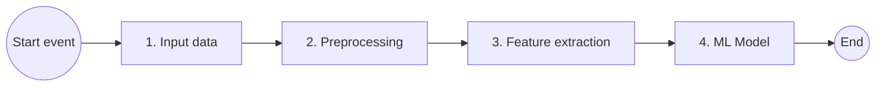

# Document Image Classification — Multiclass classifier

**Course:** CSCI E-25, Computer Vision  
**Assignment:** Project proposal  
**Author:** Kamal Dalal

## Introduction

In digital libraries, documents are often stored as images before they are processed by text extraction tools. Before extracting text from the image, classification of a document is an important step for faster and relevant information retrieval as well as record-keeping. The document image classification covers different types of documents like letter, form, email etc.

Content-based analysis of document images has a number of applications. The economic feasibility of creating a large database of document images has left a tremendous need for robust ways to access the information. Printed documents are scanned for archiving or in an attempt to move towards a paperless office and are stored as images. Documents play a pivotal role in all of the fields of business communication and record-keeping.

Complex documents present a great challenge to the field of document recognition and retrieval. The primary task of processing these complex documents is to isolate the different contents present in the documents.

## Project goal

Build a model to classify input document images as one of sixteen predefined categories. The project will use a publicly available dataset, apply preprocessing, feature extraction, and modeling to categorize the image.

## Computer vision pipeline

The following diagram shows the high-level methodology used to address the problem statement: RVL-CDIP images are ingested, preprocessed, passed through feature extraction, and classified by a multiclass model into one of sixteen document categories.



## Dataset

The **RVL-CDIP** (Ryerson Vision Lab Complex Document Information Processing) dataset consists of 400,000 grayscale images in 16 classes, with 25,000 images per class. There are 320,000 training images, 40,000 validation images, and 40,000 test images. The images are sized so their largest dimension does not exceed 1000 pixels.

Dataset size is **37 GB** (compressed), available as `rvl-cdip.tar.gz`. The categories are numbered **0–15**, in the following order:

| ID | Category |
|----|----------|
| 0 | letter |
| 1 | form |
| 2 | email |
| 3 | handwritten |
| 4 | advertisement |
| 5 | scientific report |
| 6 | scientific publication |
| 7 | specification |
| 8 | file folder |
| 9 | news article |
| 10 | budget |
| 11 | invoice |
| 12 | presentation |
| 13 | questionnaire |
| 14 | resume |
| 15 | memo |

After extracting `rvl-cdip.tar.gz`, the top-level folder **`rvl-cdip`** contains dataset notes, label files for each split, and all images. The **`labels`** directory holds `train.txt`, `val.txt`, and `test.txt`; each line is an image name (or path) and a category ID, **space-separated**. Image files live under **`images/`** (paths match the label files).

```text
rvl-cdip/
├── readme.txt
├── labels/
│   ├── train.txt
│   ├── val.txt
│   └── test.txt
└── images/
    └── ...            # grayscale document images
```

## Input data

The **RVL-CDIP** release provides a large number of images for training, validation, and testing. Working with the full corpus needs substantial compute, RAM, and disk space: the archive is about **37 GB** compressed, and roughly **50 GB** on disk after extraction. As in the layout above, pixel data lives under **`images/`**, while splits and class IDs are defined by separate **mapping files** in **`labels/`** (`train.txt`, `val.txt`, `test.txt`).

For this project, a preparation step will **sort and copy (or move) images** so that every image for a given category sits under **one folder per class**. From those class folders, a script or **Jupyter** notebook will **sample a balanced subset**—the same number of images per category—so downstream training does not inherit **class imbalance** from an arbitrary slice of the corpus.

The notebook will accept at least:

- Number of **train** images (chosen so each of the 16 categories contributes equally)
- Number of **test** images
- Number of **validation** images (parameters are supported for completeness; this project emphasizes **train** and **test**)
- **Output path** for the reduced dataset

This step **only reorganizes** files and **writes a smaller dataset** plus a **new mapping file** in the same spirit as the originals (image path or name and label per line). For this proposal, modeling will focus on **training** and **test** splits: **test** is reserved for **unseen-data** evaluation. The reduced, balanced corpus supports **end-to-end experiments on a smaller scale** before scaling to the full RVL-CDIP training set.

## Infrastructure details

Development and training will run in **Google Colaboratory** (Colab), with **Google Drive** used for persistent storage (mounting Drive in notebooks to read the dataset and save checkpoints).

The plan is to start with **Colab Pro** for better GPU access during exploratory training; **Colab Pro+** is an option if longer runs or more sustained GPU availability is needed. On the storage side, a **Google Drive** subscription at the **100 GB** tier should be sufficient for the compressed archive, extracted files, and model outputs alongside the **RVL-CDIP** dataset.
