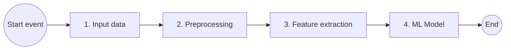
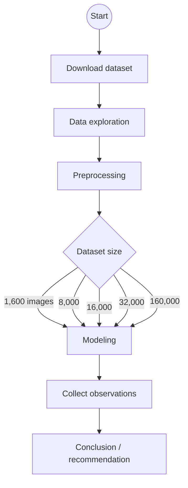

# Document Image Classification - Multiclass classifier

**Course:** CSCI E-25  
**Assignment:** Project proposal  
**Author:** Kamal Dalal

## Introduction

Content-based analysis of document images has a number of applications. The economic feasibility of creating a large database of document images has left a tremendous need for robust ways to access the information. Printed documents are scanned for archiving or in an attempt to move towards a paperless office and are stored as images. In digital libraries, documents are often stored as images before they are processed by text extraction tools. Documents play a pivotal role in all of the fields of business communication and record-keeping.

Document classification is an age-old problem in information retrieval, and it plays an important role in a variety of applications for effectively managing text and large volumes of unstructured information. **Automatic document classification** can be defined as **content-based** assignment of one or more predefined categories (topics) to documents. This makes it easier to find the relevant information at the right time and for filtering and routing documents directly to users. Automatic document classification applies machine learning or other technologies to automatically classify documents; this results in faster, more scalable, and more objective classification.

## Objective

Build a model to classify an input document image as one of the predefined categories.

The approach is **supervised learning**: the classifier is trained on **pre-labeled** document images and predicts a category for each new image. A **publicly available** dataset will be used to **train** and **test** the model.

## Computer vision pipeline

The following diagram shows the high-level methodology used to address the problem statement: RVL-CDIP images are ingested, preprocessed, passed through feature extraction, and classified by a multiclass model into one of sixteen document categories.



## Structure of the notebook

As in the workflow figure, the project starts from a **publicly available** dataset. The notebook **explores** the corpus, then applies **preprocessing** before any model design. Because of **compute and memory** limits, experiments use **smaller, sampled subsets** to build and validate models before scaling up.

The main **Colab / Jupyter** path is linear, with branches for **how much training data** is used and **which architecture** is trained.



**Preprocessing** (detail for the stage above):

- **Reorganize images** — place files in a consistent folder layout (e.g., by class or split).
- **Resize images** — standardize resolution for the model (see the **Preprocessing** section).
- **Reformat** — convert inputs such as **.tif** to **.png** when required for the training stack.

**Dataset size:** the diamond re-runs **modeling** for training subsets on the order of **1,600**, **8,000**, **16,000**, **32,000**, and **160,000** **training** images (see split note below).

**Models** (three runs per data configuration):

1. **Convolutional neural network (CNN)** — custom or from-scratch baseline.
2. **Transfer learning** with **EfficientNetB0**.
3. **Transfer learning** with **ResNet50**.

Each model is trained and evaluated on the same **train / validation / test** layout for that subset. After every run, the notebook records **training accuracy**, **validation accuracy**, **training loss**, **validation loss**, **execution time**, **number of epochs**, and related settings. **Collect observations** aggregates these runs; the final **conclusion** compares models and recommends a preferred setup from the metrics.

**Train / validation / test (per experimental dataset):**

- Splits use an **80% / 20%** ratio between **(training + validation)** combined and **held-out test**—i.e. **20%** of the images in that experimental bundle are reserved for **test**.
- Configurations are **named by the training-set size** **T** (the count of images used for weight updates).
- **Validation** uses **20% of T** additional images (**not** overlapping the **T** training images), drawn from the same balanced sampling process, for early stopping / monitoring.

Equivalently, if **T** is the training count, **validation** holds **0.2·T** images and **test** holds **0.3·T** images so that **T + 0.2T + 0.3T** is the full experimental subset and **(T + 0.2T) : 0.3T = 80 : 20**.

## Dataset

The **RVL-CDIP** (Ryerson Vision Lab Complex Document Information Processing) dataset consists of 400,000 grayscale images in 16 classes, with 25,000 images per class. There are 320,000 training images, 40,000 validation images, and 40,000 test images. The images are sized so their largest dimension does not exceed 1000 pixels.

Dataset size is **37 GB** (compressed), available as `rvl-cdip.tar.gz`. The categories are numbered **0–15**, in the following order:

| ID | Category |
|----|----------|
| 0 | letter |
| 1 | form |
| 2 | email |
| 3 | handwritten |
| 4 | advertisement |
| 5 | scientific report |
| 6 | scientific publication |
| 7 | specification |
| 8 | file folder |
| 9 | news article |
| 10 | budget |
| 11 | invoice |
| 12 | presentation |
| 13 | questionnaire |
| 14 | resume |
| 15 | memo |

After extracting `rvl-cdip.tar.gz`, the top-level folder **`rvl-cdip`** contains dataset notes, label files for each split, and all images. The **`labels`** directory holds `train.txt`, `val.txt`, and `test.txt`; each line is an image name (or path) and a category ID, **space-separated**. Image files live under **`images/`** (paths match the label files).

```text
rvl-cdip/
├── readme.txt
├── labels/
│   ├── train.txt
│   ├── val.txt
│   └── test.txt
└── images/
    └── ...            # grayscale document images
```

## Input data

The **RVL-CDIP** release provides a large number of images for training, validation, and testing. Working with the full corpus needs substantial compute, RAM, and disk space: the archive is about **37 GB** compressed, and roughly **50 GB** on disk after extraction. As in the layout above, pixel data lives under **`images/`**, while splits and class IDs are defined by separate **mapping files** in **`labels/`** (`train.txt`, `val.txt`, `test.txt`).

For this project, a preparation step will **sort and copy (or move) images** so that every image for a given category sits under **one folder per class**. From those class folders, a script or **Jupyter** notebook will **sample a balanced subset**—the same number of images per category—so downstream training does not inherit **class imbalance** from an arbitrary slice of the corpus.

The notebook will accept at least:

- Target **training** count **T** (balanced across the 16 categories; each experimental dataset is **named after** **T**)
- **Output path** for the reduced, class-balanced image pool (and mapping files in the same spirit as the originals)

**Validation** and **test** sizes for each run follow the **train / validation / test** rules in **Structure of the notebook** (80/20 development vs held-out test, with validation equal to **20% of T** on non-overlapping images).

This step **only reorganizes** files and **materializes a smaller dataset** suitable for sampling. **Test** remains reserved for **unseen-data** evaluation at the end of each experiment; **validation** supports training-time monitoring (accuracy/loss curves, early stopping). The reduced corpus supports **end-to-end experiments on a smaller scale** before scaling toward the full RVL-CDIP training set.

## Preprocessing

**RVL-CDIP** images are often around **1000 × 754** pixels, but dimensions vary across the corpus. In preprocessing, every image **produced by the input-data step** (the reduced, mapped subset) will be **resized to 512 × 512** so that all samples share the same spatial size for later feature extraction and modeling.

Because this is usually **downsampling** relative to the originals, resampling must limit **aliasing** (e.g., by using a high-quality filter or library options that apply **anti-aliasing** / low-pass behavior before decimation). Only images **listed in the prepared splits** are resized, keeping preprocessing aligned with the notebook’s output paths and mapping files.

A unified **512 × 512** grid yields **262,144** scalar values per grayscale image if the patch is flattened to a **1-D** vector (512 × 512 = 262,144). The deliverable of this stage is a **512 × 512** dataset ready for **feature extraction**, with consistent geometry across train and test.

## Feature extraction

After resizing, several **feature extraction** experiments will explore whether the representation can be compressed further before or inside the classifier. One baseline is to build a **1-D flattened** representation of training images and inspect the resulting **feature matrix** (rows as samples, columns as raw or engineered inputs).

Because the task is **document images**, layout cues such as **header**, **footer**, **left/right margins**, and **body** could motivate **region-based** models: split each page into subregions, run the same pipeline **per region**, and **aggregate** predictions or features into a final label. That direction is **aspirational** for this timeline and compute budget and may not be implemented beyond the main single-image CNN path.

**Convolutional neural networks (CNNs)** will be used for learned feature extraction. Experiments will compare feature extraction using **different numbers of channels** (**3**, **5**, and **7**), together with **parameter sharing**, **pooling** and **invariance**, and **transfer learning** from **pre-trained** networks.

The output of this stage is a **tabular (columnar) dataset**: each **row** is one image, and each **column** corresponds to features produced by successive **convolutional** (and related) blocks—suitable for downstream classification or for inspection alongside labels.

## ML model

Once convolutional blocks produce **1-D feature vectors**, several **classifiers** can sit on top for the final 16-way decision. The main line of work is a **neural network** head (multi-layer perceptron or similar) with experiments over **hidden-layer** depth and width, **activation** functions, and **number of training epochs**.

**Aspirational** extensions include classic learners such as a **support vector machine (SVM)** and **AdaBoost**, applied to the same fixed features, to compare shallow boosted or margin-based models against the neural head.

Deliverables for this stage include **training-set** summaries of **accuracy**, **recall**, and **precision** (e.g., per-class and aggregated in tabular form), plus a **performance matrix** that records **wall-clock runtime** (and key **hyper-parameters**) for each configuration. Together, these tables support **model selection** against the project’s accuracy–cost trade-offs.

## Infrastructure details

Development and training will run in **Google Colaboratory** (Colab), with **Google Drive** used for persistent storage (mounting Drive in notebooks to read the dataset and save checkpoints).

The plan is to start with **Colab Pro** for better GPU access during exploratory training; **Colab Pro+** is an option if longer runs or more sustained GPU availability is needed. On the storage side, a **Google Drive** subscription at the **100 GB** tier should be sufficient for the compressed archive, extracted files, and model outputs alongside the **RVL-CDIP** dataset.

## Conclusion

As the last step of the modeling workflow, candidate models will be **evaluated on held-out test data** (the split reserved during input-data preparation). **Side-by-side comparisons** will be reported as **graphs**, in **tabular** form, and as a concise **recommendation** for the best model for this problem statement.

## References

**RVL-CDIP** — *Ryerson Vision Lab Complex Document Information Processing.*

- **Dataset (Kaggle):** [https://www.kaggle.com/pdavpoojan/the-rvlcdip-dataset-test](https://www.kaggle.com/pdavpoojan/the-rvlcdip-dataset-test)
- **RVL-CDIP overview (Medium / Analytics Vidhya):** [https://medium.com/analytics-vidhya/rvl-cdip-ryerson-vision-lab-complex-document-information-processing-aa30b00a2b1e](https://medium.com/analytics-vidhya/rvl-cdip-ryerson-vision-lab-complex-document-information-processing-aa30b00a2b1e)
- **Harley, Ufkes & Derpanis (2015),** *Evaluation of Deep Convolutional Nets for Document Image Classification and Retrieval:* [https://arxiv.org/pdf/1502.07058v1.pdf](https://arxiv.org/pdf/1502.07058v1.pdf)
