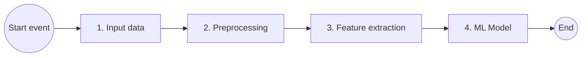
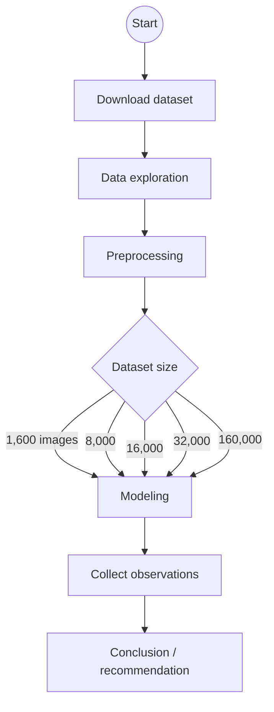
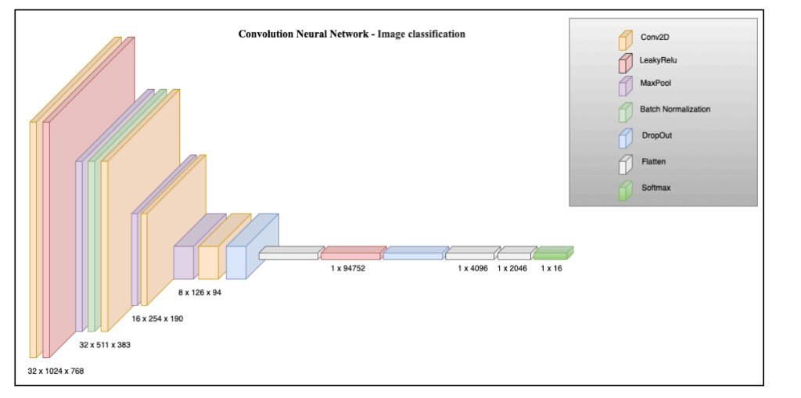

# Document Image Classification - Multiclass classifier

**Course:** CSCI E-25  
**Assignment:** Project proposal  
**Author:** Kamal Dalal

## Introduction

Content-based analysis of document images has a number of applications. The economic feasibility of creating a large database of document images has left a tremendous need for robust ways to access the information. Printed documents are scanned for archiving or in an attempt to move towards a paperless office and are stored as images. In digital libraries, documents are often stored as images before they are processed by text extraction tools. Documents play a pivotal role in all of the fields of business communication and record-keeping.

Document classification is an age-old problem in information retrieval, and it plays an important role in a variety of applications for effectively managing text and large volumes of unstructured information. **Automatic document classification** can be defined as **content-based** assignment of one or more predefined categories (topics) to documents. This makes it easier to find the relevant information at the right time and for filtering and routing documents directly to users. Automatic document classification applies machine learning or other technologies to automatically classify documents; this results in faster, more scalable, and more objective classification.

## Objective

Build a model to classify an input document image as one of the predefined categories.

The approach is **supervised learning**: the classifier is trained on **pre-labeled** document images and predicts a category for each new image. A **publicly available** dataset will be used to **train** and **test** the model.

## Computer vision pipeline

The following diagram shows the high-level methodology used to address the problem statement: RVL-CDIP images are ingested, preprocessed, passed through feature extraction, and classified by a multiclass model into one of sixteen document categories.



## Structure of the notebook

As in the workflow figure, the project starts from a **publicly available** dataset. The notebook **explores** the corpus, then applies **preprocessing** before any model design. Because of **compute and memory** limits, experiments use **smaller, sampled subsets** to build and validate models before scaling up.

The main **Colab / Jupyter** path is linear, with branches for **how much training data** is used and **which architecture** is trained.



**Preprocessing** (detail for the stage above):

- **Reorganize images** — place files in a consistent folder layout (e.g., by class or split).
- **Resize images** — standardize resolution for the model (see the **Preprocessing** section).
- **Reformat** — convert **.tif** to **.png** for smaller Drive footprint and **Keras** pre-trained pipelines (see **Preprocessing**, Step 3).

**Dataset size (iterative):** experiments sweep how many **training** images are sampled **per category**—**100**, **500**, **1,000**, **2,000**, and **10,000**. With **16** classes, that is **1,600**, **8,000**, **16,000**, **32,000**, and **160,000** **training** images in total, matching the branches in the diagram. The same **generate_dataset**-style pipeline builds each regime; to avoid repeating long sections, the **notebook** walks through **only three** of these sizes as **demonstrations** (the procedure is identical for the rest).

**Example — “Dataset 16,000”:** **1,000** images **per category** for **training** and **200** **per category** for a **held-out evaluation** split sampled from the reorganized **`test`** tree (**3,200** images total = 200 × 16). (If you instead reserve **200** **per category** strictly for **validation** during training, use the same sampling pattern on a `validation/` tree or a carved subset.) The run name follows total **training** images: 16 × 1,000 = **16,000**. Exported tiles for this run are **1000 × 768** pixels (other experiments may use **512 × 512**, as in **Preprocessing**).

**Observed pool sizes (example machine):** under **`/Volumes/T7/rvl-cdip/train/<class>/`**, each class folder holds on the order of **~19.8k–20.1k** TIFFs (consistent with **~20k** train images per class in RVL-CDIP). `generate_dataset` logs one line per directory; for **1,000** images per class you see e.g. `Directory .../train/15 has 19975 files, we have to choose 1000 files (randomly).` — then it writes **1,000** random **PNG**s per class. For **Dataset 32,000** (**2,000** per class), the same pools yield **`choose 2000 files (randomly)`**. For **Dataset 160,000** (**10,000** per class; grid step **5**), you see **`choose 10000 files (randomly)`**—still a random subset of the **~20k** pool. Full **train** logs from one machine (**2,000** and **10,000** per class) below; line order follows how **`os.walk`** visits folders, not numeric class order.

```text
Directory /Volumes/T7/rvl-cdip/train/15 has 19975 files, we have to choose 2000 files (randomly).
Directory /Volumes/T7/rvl-cdip/train/1 has 19957 files, we have to choose 2000 files (randomly).
Directory /Volumes/T7/rvl-cdip/train/7 has 19997 files, we have to choose 2000 files (randomly).
Directory /Volumes/T7/rvl-cdip/train/10 has 20010 files, we have to choose 2000 files (randomly).
Directory /Volumes/T7/rvl-cdip/train/3 has 20031 files, we have to choose 2000 files (randomly).
Directory /Volumes/T7/rvl-cdip/train/14 has 20006 files, we have to choose 2000 files (randomly).
Directory /Volumes/T7/rvl-cdip/train/11 has 19944 files, we have to choose 2000 files (randomly).
Directory /Volumes/T7/rvl-cdip/train/13 has 20042 files, we have to choose 2000 files (randomly).
Directory /Volumes/T7/rvl-cdip/train/0 has 20103 files, we have to choose 2000 files (randomly).
Directory /Volumes/T7/rvl-cdip/train/2 has 19954 files, we have to choose 2000 files (randomly).
Directory /Volumes/T7/rvl-cdip/train/9 has 19987 files, we have to choose 2000 files (randomly).
Directory /Volumes/T7/rvl-cdip/train/4 has 19963 files, we have to choose 2000 files (randomly).
Directory /Volumes/T7/rvl-cdip/train/12 has 20043 files, we have to choose 2000 files (randomly).
Directory /Volumes/T7/rvl-cdip/train/5 has 19984 files, we have to choose 2000 files (randomly).
Directory /Volumes/T7/rvl-cdip/train/6 has 19829 files, we have to choose 2000 files (randomly).
Directory /Volumes/T7/rvl-cdip/train/8 has 20012 files, we have to choose 2000 files (randomly).
```

**Dataset 160,000** (**10,000** images per class from **`train`**):

```text
Directory /Volumes/T7/rvl-cdip/train/15 has 19975 files, we have to choose 10000 files (randomly).
Directory /Volumes/T7/rvl-cdip/train/1 has 19957 files, we have to choose 10000 files (randomly).
Directory /Volumes/T7/rvl-cdip/train/7 has 19997 files, we have to choose 10000 files (randomly).
Directory /Volumes/T7/rvl-cdip/train/10 has 20010 files, we have to choose 10000 files (randomly).
Directory /Volumes/T7/rvl-cdip/train/3 has 20031 files, we have to choose 10000 files (randomly).
Directory /Volumes/T7/rvl-cdip/train/14 has 20006 files, we have to choose 10000 files (randomly).
Directory /Volumes/T7/rvl-cdip/train/11 has 19944 files, we have to choose 10000 files (randomly).
Directory /Volumes/T7/rvl-cdip/train/13 has 20042 files, we have to choose 10000 files (randomly).
Directory /Volumes/T7/rvl-cdip/train/0 has 20103 files, we have to choose 10000 files (randomly).
Directory /Volumes/T7/rvl-cdip/train/2 has 19954 files, we have to choose 10000 files (randomly).
Directory /Volumes/T7/rvl-cdip/train/9 has 19987 files, we have to choose 10000 files (randomly).
Directory /Volumes/T7/rvl-cdip/train/4 has 19963 files, we have to choose 10000 files (randomly).
Directory /Volumes/T7/rvl-cdip/train/12 has 20043 files, we have to choose 10000 files (randomly).
Directory /Volumes/T7/rvl-cdip/train/5 has 19984 files, we have to choose 10000 files (randomly).
Directory /Volumes/T7/rvl-cdip/train/6 has 19829 files, we have to choose 10000 files (randomly).
Directory /Volumes/T7/rvl-cdip/train/8 has 20012 files, we have to choose 10000 files (randomly).
```

Under **`.../rvl-cdip/test/<class>/`**, pools are **~2.4k–2.6k** TIFFs per class (about **2,500** on average, matching **40k** test ÷ **16**). For **Dataset 16,000** the log shows **`choose 200 files (randomly)`**; for **Dataset 32,000** (**6,400**-image eval stream) it shows **`choose 400 files (randomly)`**; for **Dataset 160,000** train / **32,000** validation it shows **`choose 2000 files (randomly)`** (still below the per-class **test** pool). Full **test** logs: **400**/class (**Dataset 32,000** eval stream) and **2000**/class (**32,000**-image stream for grid step **5**) from example runs:

```text
Directory /Volumes/T7/rvl-cdip/test/3 has 2532 files, we have to choose 400 files (randomly).
Directory /Volumes/T7/rvl-cdip/test/14 has 2536 files, we have to choose 400 files (randomly).
Directory /Volumes/T7/rvl-cdip/test/2 has 2516 files, we have to choose 400 files (randomly).
Directory /Volumes/T7/rvl-cdip/test/9 has 2463 files, we have to choose 400 files (randomly).
Directory /Volumes/T7/rvl-cdip/test/6 has 2570 files, we have to choose 400 files (randomly).
Directory /Volumes/T7/rvl-cdip/test/13 has 2435 files, we have to choose 400 files (randomly).
Directory /Volumes/T7/rvl-cdip/test/8 has 2527 files, we have to choose 400 files (randomly).
Directory /Volumes/T7/rvl-cdip/test/0 has 2464 files, we have to choose 400 files (randomly).
Directory /Volumes/T7/rvl-cdip/test/7 has 2472 files, we have to choose 400 files (randomly).
Directory /Volumes/T7/rvl-cdip/test/5 has 2498 files, we have to choose 400 files (randomly).
Directory /Volumes/T7/rvl-cdip/test/1 has 2506 files, we have to choose 400 files (randomly).
Directory /Volumes/T7/rvl-cdip/test/15 has 2492 files, we have to choose 400 files (randomly).
Directory /Volumes/T7/rvl-cdip/test/11 has 2477 files, we have to choose 400 files (randomly).
Directory /Volumes/T7/rvl-cdip/test/10 has 2505 files, we have to choose 400 files (randomly).
Directory /Volumes/T7/rvl-cdip/test/12 has 2489 files, we have to choose 400 files (randomly).
Directory /Volumes/T7/rvl-cdip/test/4 has 2515 files, we have to choose 400 files (randomly).
```

That pass writes **400** random **PNG**s per class (**6,400** total). Line order follows **`os.walk`**, not class ID order.

```text
Directory /Volumes/T7/rvl-cdip/test/3 has 2532 files, we have to choose 2000 files (randomly).
Directory /Volumes/T7/rvl-cdip/test/14 has 2536 files, we have to choose 2000 files (randomly).
Directory /Volumes/T7/rvl-cdip/test/2 has 2516 files, we have to choose 2000 files (randomly).
Directory /Volumes/T7/rvl-cdip/test/9 has 2463 files, we have to choose 2000 files (randomly).
Directory /Volumes/T7/rvl-cdip/test/6 has 2570 files, we have to choose 2000 files (randomly).
TiffPages: invalid page offset 85476
Directory /Volumes/T7/rvl-cdip/test/13 has 2435 files, we have to choose 2000 files (randomly).
Directory /Volumes/T7/rvl-cdip/test/8 has 2527 files, we have to choose 2000 files (randomly).
Directory /Volumes/T7/rvl-cdip/test/0 has 2464 files, we have to choose 2000 files (randomly).
Directory /Volumes/T7/rvl-cdip/test/7 has 2472 files, we have to choose 2000 files (randomly).
Directory /Volumes/T7/rvl-cdip/test/5 has 2498 files, we have to choose 2000 files (randomly).
Directory /Volumes/T7/rvl-cdip/test/1 has 2506 files, we have to choose 2000 files (randomly).
Directory /Volumes/T7/rvl-cdip/test/15 has 2492 files, we have to choose 2000 files (randomly).
Directory /Volumes/T7/rvl-cdip/test/11 has 2477 files, we have to choose 2000 files (randomly).
Directory /Volumes/T7/rvl-cdip/test/10 has 2505 files, we have to choose 2000 files (randomly).
Directory /Volumes/T7/rvl-cdip/test/12 has 2489 files, we have to choose 2000 files (randomly).
Directory /Volumes/T7/rvl-cdip/test/4 has 2515 files, we have to choose 2000 files (randomly).
```

That pass writes **2,000** random **PNG**s per class (**32,000** total). **`TiffPages: invalid page offset …`** is a **TIFF** reader warning (often a truncated or nonstandard file in the corpus); the export may **skip** that image, so **`flow_from_directory`** can report **slightly fewer** than **32,000** files—same idea as missing counts on **train** (see the **`Found …`** **`test`** line under **Dataset 160,000** in **Modeling**).

**Models** (three per dataset size — see **Modeling**): **CNN** (**Conv2D** + **LeakyReLU** / **ReLU**, **MaxPool**, **BatchNorm**, **Dropout**, **Dense(16)** bottleneck + **L2**, **softmax**), **EfficientNetB0**, **ResNet50**. **Early stopping** on **validation accuracy**, **patience = 4** epochs.

Each model is trained on the same **train / validation / test** layout for that subset. After every run, the notebook records **training accuracy**, **validation accuracy**, **training loss**, **validation loss**, **execution time**, **number of epochs**, and related settings. **Collect observations** aggregates these runs; the final **conclusion** compares models and recommends a preferred setup from the metrics.

**Train / validation / test (per experimental dataset):**

- Splits use an **80% / 20%** ratio between **(training + validation)** combined and **held-out test**—i.e. **20%** of the images in that experimental bundle are reserved for **test**.
- Configurations are **named by the training-set size** **T** (the count of images used for weight updates).
- **Validation** uses **20% of T** additional images (**not** overlapping the **T** training images), drawn from the same balanced sampling process, for early stopping / monitoring.

Equivalently, if **T** is the training count, **validation** holds **0.2·T** images and **test** holds **0.3·T** images so that **T + 0.2T + 0.3T** is the full experimental subset and **(T + 0.2T) : 0.3T = 80 : 20**.

## Download dataset

This project uses **RVL-CDIP** (*Ryerson Vision Lab Complex Document Information Processing*): scanned **grayscale** document images in **16** classes (e.g., letter, form, email, resume, memo, and others in the table below). The release is **public**; the archive is typically named **`rvl-cdip.tar.gz`**, about **37 GB** compressed. Uncompressed on disk, the corpus is on the order of **~100 GB**.

The full split is fixed in the source distribution: **320,000** training, **40,000** validation, and **40,000** test images (often described as **train / validation / test** or **train / dev / test**). **Note:** all images are **grayscale**.

**Reference:** A. W. Harley, A. Ufkes, K. G. Derpanis, *Evaluation of Deep Convolutional Nets for Document Image Classification and Retrieval,* ICDAR, 2015 — [https://www.cs.cmu.edu/~aharley/icdar15](https://www.cs.cmu.edu/~aharley/icdar15)

## Dataset

The **RVL-CDIP** dataset contains **400,000** images in **16** balanced classes (**25,000** per class). Official splits: **320k / 40k / 40k** for train, validation, and test. Image dimensions vary; the largest side is capped around **1000** pixels in the release.

The compressed archive (**~37 GB**, `rvl-cdip.tar.gz`) unpacks to a tree summarized below. Class IDs **0–15** follow this order:

| ID | Category |
|----|----------|
| 0 | letter |
| 1 | form |
| 2 | email |
| 3 | handwritten |
| 4 | advertisement |
| 5 | scientific report |
| 6 | scientific publication |
| 7 | specification |
| 8 | file folder |
| 9 | news article |
| 10 | budget |
| 11 | invoice |
| 12 | presentation |
| 13 | questionnaire |
| 14 | resume |
| 15 | memo |

After extracting `rvl-cdip.tar.gz`, the top-level folder **`rvl-cdip`** contains dataset notes, label files for each split, and all images. The **`labels`** directory holds `train.txt`, `val.txt`, and `test.txt`; each line is an image name (or path) and a category ID, **space-separated**. Image files live under **`images/`** (paths match the label files).

```text
rvl-cdip/
├── readme.txt
├── labels/
│   ├── train.txt
│   ├── val.txt
│   └── test.txt
└── images/
    └── ...            # grayscale document images
```

## Data exploration

In this step the notebook **inspects** the release to understand the **images** and **labels** before preprocessing. The official split sizes are **320,000** training, **40,000** validation, and **40,000** test images (as in **Download dataset**). Images are **grayscale** scans whose **largest dimension does not exceed 1000** pixels (exact width/height varies by page).

Representative **one-image-per-category** thumbnails illustrate how layout, typography, and structure differ across classes (grid order is for display only; canonical **0–15** IDs are in the **Dataset** table):


**Label files** under `labels/` (`train.txt`, `val.txt`, `test.txt`) list one sample per line:

```text
path/to/the/image.tif 3
```

Each line is **`path/to/the/image.tif`** (path relative to the dataset root or `images/`, depending on the release), then a **separator**, then the **integer category** **0–15**. (Some mirrors use multiple spaces or tabs; split on whitespace and take the last token as the class ID.)

Categories are integers **0** through **15** in the fixed order **letter → form → email → … → memo** (full table in **Dataset** above).

*(If you list classes **1–16** in prose, subtract one to match the ID in the label files.)*

## Input data

The **RVL-CDIP** release provides a large number of images for training, validation, and testing. Working with the full corpus needs substantial compute, RAM, and disk space: the archive is about **37 GB** compressed, and roughly **~100 GB** on disk after extraction. As in the layout above, pixel data lives under **`images/`**, while splits and class IDs are defined by separate **mapping files** in **`labels/`** (`train.txt`, `val.txt`, `test.txt`).

For this project, a preparation step will **sort and copy (or move) images** so that every image for a given category sits under **one folder per class**. From those class folders, a script or **Jupyter** notebook will **sample a balanced subset**—the same number of images per category—so downstream training does not inherit **class imbalance** from an arbitrary slice of the corpus.

The notebook will accept at least:

- Target **training** count **T** (balanced across the 16 categories; each experimental dataset is **named after** **T**)
- **Output path** for the reduced, class-balanced image pool (and mapping files in the same spirit as the originals)

**Validation** and **test** sizes for each run follow the **train / validation / test** rules in **Structure of the notebook** (80/20 development vs held-out test, with validation equal to **20% of T** on non-overlapping images).

This step **only reorganizes** files and **materializes a smaller dataset** suitable for sampling. **Test** remains reserved for **unseen-data** evaluation at the end of each experiment; **validation** supports training-time monitoring (accuracy/loss curves, early stopping). The reduced corpus supports **end-to-end experiments on a smaller scale** before scaling toward the full RVL-CDIP training set.

## Preprocessing

Preprocessing follows the notebook stages: **(1) reorganize** images for the loader, **(2) resize** to a target resolution (with dimension exploration first), and **(3) reformat** **.tif → .png** for **Keras** pre-trained models and **smaller** cloud storage.

### Step 1 — Reorganize images (Keras-friendly layout)

The official release stores all pixels under a single **`images/`** tree while **`labels/*.txt`** list `(path, class_id)` rows. That layout is awkward for **`ImageDataGenerator.flow_from_directory`** (and similar APIs), which expect **`train/`** and **`test/`** (and optionally **`validation/`**) with **one subfolder per class**.

For this project, images are sorted into:

```text
<target>/train/0/  ... <target>/train/15/
<target>/test/0/   ... <target>/test/15/
```

using **`labels/train.txt`** and **`labels/test.txt`** (**320k** train, **40k** test per the release). **Note:** this step uses **train** and **test** only here; you can mirror the same pattern for **`val.txt`** if you train against the official validation split.

Example layout after reorganizing:


A small CLI wraps the same logic as the notebook (defaults to **copy**; pass **`--move`** only if you want to empty the original `images/` tree):

```bash
python scripts/organize_rvl_cdip_for_keras.py \
  --source /path/to/rvl-cdip-orig \
  --target /path/to/rvl-cdip-keras
```

### Step 2 — Resize and unify geometry

After **Step 1**, the corpus is still at **native** resolutions across hundreds of thousands of files. Before choosing a target size and resampling policy, the notebook **profiles** the data and answers:

1. **Do the images have different dimensions?** For **RVL-CDIP**, **yes**: widths and heights vary by scan; only the **longest side** is capped at about **1000** pixels in the release, so many distinct **(width, height)** pairs appear rather than a single global shape.
2. **If so, is there a distribution of images by dimension?** The exploration step **measures** each image (or a **stratified sample** if scanning the full **400k** is too slow), then summarizes **frequency** of each shape **(H, W)** from the array (and optionally **max(H, W)** buckets). Typical outputs are **histograms** or **bar charts** of the most common sizes, plus **min/max** height and width across the corpus. That shows how aggressive resizing will be (mostly **downsampling** vs occasional **upsampling**) and motivates **anti-aliasing** when shrinking.

**Notebook sketch** (suppress heavy output with `%%capture` on the first cell if desired):

```python
# Min/max and per-shape counts over train/test/(val) trees — uses scikit-image
import os
import matplotlib.pyplot as plt
import skimage.io as skio

base_path = "/path/to/rvl-cdip"  # Keras-style root after Step 1
size_dir = {}

for root, dirs, files in os.walk(base_path):
    for file in files:
        file_path = os.path.join(root, file)
        if ".tif" not in file_path.lower():
            continue
        # Optional: skip paths with '_' if you use a naming convention; often better to omit this.
        # if "_" in file_path:
        #     continue
        img = skio.imread(file_path)
        if img.ndim != 2:
            continue  # grayscale RVL-CDIP → (H, W); skip accidental RGB stacks
        key = img.shape
        size_dir[key] = size_dir.get(key, 0) + 1

# Bar-style view: shapes with more than 3000 images (tune threshold)
filtered = {f"{h}_{w}": c for (h, w), c in size_dir.items() if c > 3000}
lists = sorted(filtered.items(), key=lambda kv: kv[1], reverse=True)
if lists:
    labels, counts = zip(*lists)
    fig, ax = plt.subplots(figsize=(12, 6))
    ax.bar(range(len(labels)), counts)
    ax.set_xticks(range(len(labels)))
    ax.set_xticklabels(labels, rotation=75, ha="right")
    ax.set_xlabel("height_width (pixels)")
    ax.set_ylabel("number of images")
    ax.set_title("Number of images by dimension")
    fig.tight_layout()
    plt.show()
```

For a faster pass over huge trees, use [`scripts/analyze_rvl_cdip_dimensions.py`](scripts/analyze_rvl_cdip_dimensions.py) (**Pillow** metadata; optional **`--save-plot`**) after `pip install -r requirements.txt`:

```bash
python scripts/analyze_rvl_cdip_dimensions.py --root /path/to/rvl-cdip --min-count 3000
```

#### Answers (dimension exploration)

1. **Images vary in size.** The bar chart of shapes with **at least 3,000** images shows that the **mode** is close to **1000 × 754** pixels: that single **(H, W)** bin has the **largest** count, yet it still covers only about **46%** of all images—the remainder spread across many other resolutions.
2. **Resizing to a fixed square (e.g. 512 × 512)** therefore **downsamples** some pages and **upsamples** others relative to their native size. For **downsampling**, resampling should limit **aliasing** (high-quality filters, library **anti-aliasing** options, or low-pass behavior before decimation).

The modeling pipeline applies this resize to the images selected for each experiment (not necessarily the full **400k** train split when **compute** or **storage** is limited).

### Step 3 — Reformat images (TIFF → PNG)

The release is mostly **TIFF (`.tif`)**, which is awkward for many **Keras** **pre-trained** workflows (inputs are commonly **PNG**/**JPEG** or arrays loaded through stacks tuned for those formats). The notebook converts to **PNG** for two reasons:

1. **PNG** files are typically **much smaller** than the originals, which eases **upload and sync to Google Drive** under quota limits.
2. **PNG** inputs align with the path of least resistance for **Keras** **pre-trained** models and standard `ImageDataGenerator` / `flow_from_directory` setups.

**Reusable resize + export:** instead of a one-off batch job, preprocessing is wrapped in a **reusable function** (parameterized **output size**, paths, and sample counts) so the same code can regenerate **different-sized** datasets (**224²**, **512²**, etc.) as experiments evolve. Given **compute** and **storage** limits, the project may **not** process the **entire** corpus every time—subsets are drawn per configuration.

**Sampling:** when selecting which files to process from each class folder, the notebook uses **`random.sample`** over eligible **`.tif`** paths (skipping macOS **`._*`** forks) so the subset is not biased by **directory listing order**.

**Notebook — `generate_dataset` (concept):** walk the Keras-style tree; in each leaf directory with TIFFs, draw up to **`desired_size_per_category`** files at random; **`skimage.transform.resize`** with **`anti_aliasing=True`** and **`preserve_range=True`**; write **`.png`** under **`target_path`** with the same relative paths as **`source_path`**. Note: **`resize`** expects **`output_shape = (height, width)`** (rows × columns), not `(width, height)`.

```python
import os
import random
import numpy as np
import skimage.io as skio
import skimage.transform as sktran


def generate_dataset(width, height, target_path, source_path, desired_size_per_category, seed=None):
    if seed is not None:
        random.seed(seed)
    source_path = os.path.abspath(source_path)
    target_path = os.path.abspath(target_path)
    category = 0
    for root, _dirs, files in os.walk(source_path):
        tifs = [
            f
            for f in files
            if f.lower().endswith((".tif", ".tiff")) and not f.startswith("._")
        ]
        if not tifs:
            continue
        k = min(desired_size_per_category, len(tifs))
        chosen = set(random.sample(tifs, k))
        print(f"{root}: {len(tifs)} TIFFs, using {k} at random")

        for fname in files:
            if fname not in chosen:
                continue
            src = os.path.join(root, fname)
            img = skio.imread(src)
            if img.size == 0:
                continue
            resized = sktran.resize(
                img.astype(np.float64),
                (height, width),  # skimage: (rows, cols) = (height, width)
                anti_aliasing=True,
                preserve_range=True,
            )
            rel = os.path.relpath(src, source_path)
            dst = os.path.join(target_path, os.path.splitext(rel)[0] + ".png")
            os.makedirs(os.path.dirname(dst), exist_ok=True)
            out = np.clip(np.round(resized), 0, 255).astype(np.uint8)
            skio.imsave(dst, out, check_contrast=False)
        category += 1
```

**Example — training split for “Dataset 16,000” (1000 × 768 px, 1000 images per category):** `source_path` points at the **`train`** folder only, so class folders **`0` … `15`** are created directly under **`target_path`**. Adjust paths for **Colab** (Drive mount) or another disk as needed.

```python
# Generate train dataset for 1000×768 with 1000 images per category
source_path = "/Volumes/T7/rvl-cdip/train"
target_path = "/Volumes/T7/sample_1000/rvl-cdip/"
desired_size_per_category = 1000
width = 1000
height = 768
generate_dataset(width, height, target_path, source_path, desired_size_per_category)
```

**Test / eval sample (200 per category → 3,200 total), same spatial size:** here **`target_path`** matches the **train** export so both splits land under **`sample_1000/rvl-cdip/<class>/`**. That is safe when **train** and **test** basenames do not collide (usual for RVL-CDIP); if they ever overlap, point **`test`** at a sibling folder (e.g. **`.../sample_1000/rvl-cdip_test/`**) or nest **`train/`** vs **`test/`** in the target.

```python
# Generate test dataset for 1000×768 with 200 images for each category
source_path = "/Volumes/T7/rvl-cdip/test"
target_path = "/Volumes/T7/sample_1000/rvl-cdip/"
desired_size_per_category = 200
width = 1000
height = 768
generate_dataset(width, height, target_path, source_path, desired_size_per_category)
```

**Example — “Dataset 32,000” (1000 × 768 px, 2000 images per category for training):** same layout as **16,000**, but **`sample_2000`** and **`desired_size_per_category = 2000`**. This matches grid **step 4** (**32,000** = **16 × 2,000** train images).

```python
# Generate train dataset for 1000×768 with 2000 images for each category
source_path = "/Volumes/T7/rvl-cdip/train"
target_path = "/Volumes/T7/sample_2000/rvl-cdip/"
desired_size_per_category = 2000
width = 1000
height = 768
generate_dataset(width, height, target_path, source_path, desired_size_per_category)
```

**Eval stream for the same scale (400 per category → 6,400 total), same spatial size:** keep the **5∶1** ratio (**2,000∶400**) with the **official `test`** TIFF tree.

```python
# Generate test dataset for 1000×768 with 400 images for each category
source_path = "/Volumes/T7/rvl-cdip/test"
target_path = "/Volumes/T7/sample_2000/rvl-cdip/"
desired_size_per_category = 400
width = 1000
height = 768
generate_dataset(width, height, target_path, source_path, desired_size_per_category)
```

**Same eval stream under a different output root (`sample_5000`):** some notebooks keep **train** PNGs under **`sample_2000`** but write the **400**/class **test** sample under **`sample_5000`** (name is conventional—**6,400** images total, not **5,000**). The code below matches a typical cell; the comment must say **400** images per category, not **1,000** (a **1,000**/class line would refer to the **train** pass only).

```python
# Generate test dataset for 1000×768 with 400 images for each category
source_path = "/Volumes/T7/rvl-cdip/test"
target_path = "/Volumes/T7/sample_5000/rvl-cdip/"
desired_size_per_category = 400
width = 1000
height = 768
generate_dataset(width, height, target_path, source_path, desired_size_per_category)
```

**`flow_from_directory`:** if your generator paths look like **`.../rvl-cdip/train/`** and **`.../rvl-cdip/test/`**, point **`target_path`** at **`.../sample_5000/rvl-cdip/test`** for this pass (and **`.../sample_5000/rvl-cdip/train`** when exporting **train**), so **`0` … `15`** live under the correct split folder.

On **Colab**, mirror these paths under **`/content/sample_2000/rvl-cdip/`** (or **`/content/drive/...`**) the same way as **`sample_1000`**; use **`/content/sample_5000/...`** if you adopt that root.

CLI equivalent (same logic, portable paths): [`scripts/generate_resampled_dataset.py`](scripts/generate_resampled_dataset.py)

```bash
# 512×512 example
python scripts/generate_resampled_dataset.py \
  --width 512 --height 512 \
  --source /path/to/rvl-cdip-tif \
  --target /path/to/rvl-cdip-png \
  --per-class 1000 \
  --seed 42
```

```bash
# Same as notebook snippet: 1000×768, train tree only, 1000 per class
python scripts/generate_resampled_dataset.py \
  --width 1000 --height 768 \
  --source /Volumes/T7/rvl-cdip/train \
  --target /Volumes/T7/sample_1000/rvl-cdip \
  --per-class 1000 \
  --seed 42
```

```bash
# Test tree: 200 per class → 3,200 PNGs (same target root as train snippet above)
python scripts/generate_resampled_dataset.py \
  --width 1000 --height 768 \
  --source /Volumes/T7/rvl-cdip/test \
  --target /Volumes/T7/sample_1000/rvl-cdip \
  --per-class 200 \
  --seed 42
```

```bash
# Dataset 32,000: train tree, 2000 per class → 32,000 PNGs under sample_2000
python scripts/generate_resampled_dataset.py \
  --width 1000 --height 768 \
  --source /Volumes/T7/rvl-cdip/train \
  --target /Volumes/T7/sample_2000/rvl-cdip \
  --per-class 2000 \
  --seed 42
```

```bash
# Test tree: 400 per class → 6,400 PNGs (same target root as train snippet above)
python scripts/generate_resampled_dataset.py \
  --width 1000 --height 768 \
  --source /Volumes/T7/rvl-cdip/test \
  --target /Volumes/T7/sample_2000/rvl-cdip \
  --per-class 400 \
  --seed 42
```

```bash
# Test tree: 400 per class → 6,400 PNGs under sample_5000 (alternative root)
python scripts/generate_resampled_dataset.py \
  --width 1000 --height 768 \
  --source /Volumes/T7/rvl-cdip/test \
  --target /Volumes/T7/sample_5000/rvl-cdip \
  --per-class 400 \
  --seed 42
```

**Example — Dataset 160,000 train / 32,000 validation (grid step **5**):** **10,000** images per category from **`train`** (**160,000** total) and **2,000** per category from **`test`** (**32,000** total), keeping the same **5∶1** **train∶eval** ratio as **16,000** / **3,200** and **32,000** / **6,400**. Use a dedicated root such as **`sample_10000`** so paths stay parallel to **`sample_1000`**, **`sample_2000`**, and **`sample_5000`**.

```python
# Generate train dataset for 1000×768 with 10000 images per category (160,000 total → sample_10000)
source_path = "/Volumes/T7/rvl-cdip/train"
target_path = "/Volumes/T7/sample_10000/rvl-cdip/"
desired_size_per_category = 10000
width = 1000
height = 768
generate_dataset(width, height, target_path, source_path, desired_size_per_category)
```

```python
# Generate test dataset for 1000×768 with 2000 images per category (32,000 validation stream; same target root as train)
source_path = "/Volumes/T7/rvl-cdip/test"
target_path = "/Volumes/T7/sample_10000/rvl-cdip/"
desired_size_per_category = 2000
width = 1000
height = 768
generate_dataset(width, height, target_path, source_path, desired_size_per_category)
```

On **Colab**, mirror under **`/content/sample_10000/rvl-cdip/train/`** and **`.../test/`** (or **`/content/drive/...`**). **`flow_from_directory`** logs may show **slightly fewer** than **160,000** / **32,000** files if any writes fail (same pattern as **`15999`** / **`3199`** on smaller scales).

```bash
# Dataset 160,000: train tree, 10000 per class → 160,000 PNGs under sample_10000
python scripts/generate_resampled_dataset.py \
  --width 1000 --height 768 \
  --source /Volumes/T7/rvl-cdip/train \
  --target /Volumes/T7/sample_10000/rvl-cdip \
  --per-class 10000 \
  --seed 42
```

```bash
# Test tree: 2000 per class → 32,000 PNGs (same target root as train snippet above)
python scripts/generate_resampled_dataset.py \
  --width 1000 --height 768 \
  --source /Volumes/T7/rvl-cdip/test \
  --target /Volumes/T7/sample_10000/rvl-cdip \
  --per-class 2000 \
  --seed 42
```

**Summary:** `generate_dataset` (and the CLI) build a new dataset from parameters **`height`**, **`width`**, and **`desired_size_per_category`** (maximum images sampled **per class folder**). Output keeps the same **directory tree** as the Keras-style source—e.g. **`train/0/` … `train/15/`**, **`test/0/` …**—so it can be passed straight to **`ImageDataGenerator.flow_from_directory`**. Files are written as **PNG**, which works smoothly with **Keras** **pre-trained** inputs and is smaller than **TIFF** for cloud storage.

**Note:** Within each category folder, the images used are chosen **uniformly at random** from those available (up to the requested cap), avoiding bias from on-disk ordering.

A unified target grid (e.g. **512 × 512**) yields **262,144** scalar values per **grayscale** image if flattened to a **1-D** vector. **Grayscale** can be saved as single-channel PNG or stacked to **3-channel** for RGB-pretrained nets, depending on the model. The deliverable of preprocessing is a **consistent** dataset (paths, size, format) ready for **feature extraction** and modeling.

## Feature extraction

After resizing, several **feature extraction** experiments will explore whether the representation can be compressed further before or inside the classifier. One baseline is to build a **1-D flattened** representation of training images and inspect the resulting **feature matrix** (rows as samples, columns as raw or engineered inputs).

Because the task is **document images**, layout cues such as **header**, **footer**, **left/right margins**, and **body** could motivate **region-based** models: split each page into subregions, run the same pipeline **per region**, and **aggregate** predictions or features into a final label. That direction is **aspirational** for this timeline and compute budget and may not be implemented beyond the main single-image CNN path.

**Convolutional neural networks (CNNs)** will be used for learned feature extraction. Experiments will compare feature extraction using **different numbers of channels** (**3**, **5**, and **7**), together with **parameter sharing**, **pooling** and **invariance**, and **transfer learning** from **pre-trained** networks.

The output of this stage is a **tabular (columnar) dataset**: each **row** is one image, and each **column** corresponds to features produced by successive **convolutional** (and related) blocks—suitable for downstream classification or for inspection alongside labels.

## Modeling

Training compares **three** model families on the **same** sampled datasets, across **five** training scales. **Objective:** build a **metrics matrix** (dataset size × model) so the best **model** and **data scale** can be chosen from **validation** (and **test**) performance, **loss**, **runtime**, and **epochs**—aligned with **Collect observations** in the notebook flow.

**Architectures**

1. **Convolutional neural network (CNN)** — custom **from-scratch** document classifier (details below).
2. **EfficientNetB0** — **transfer learning** (ImageNet-pretrained backbone, task-specific head).
3. **ResNet50** — **transfer learning** (same pattern).

### Convolutional neural network (CNN)

This **CNN** is built to **classify document images** into the **16** RVL-CDIP categories for each sampled dataset. The schematic figure matches the **same** topology as the **`model.summary()`** below (tensor shapes are for **`input_shape=(1024, 768, 1)`** with **valid** **3×3** convs).



**Block summary (`input_shape=(1024, 768, 1)`; adjust for `(1000, 768, 1)` if needed):**

1. **Conv2D** 32 × **3×3** (linear) → **LeakyReLU** (**α = 0.2**) → **(1022, 766, 32)**.
2. **MaxPool2D** **2×2** → **(511, 383, 32)** → **BatchNormalization** (**momentum 0.8**).
3. **Conv2D** 16 × **3×3**, **ReLU** → **MaxPool2D** → **Conv2D** 8 × **3×3**, **ReLU** → **MaxPool2D** → **(126, 94, 8)**.
4. **Dropout** (**0.10**) → **Flatten** → **94,752** → **LeakyReLU** (**α = 0.1**).
5. **Dense(16)**, **ReLU**, **L2(0.001)** (bottleneck) → **Dropout** (**0.15**) → **Dense(4096)**, **ReLU** → **Dense(2048)**, **ReLU** → **Dense(16)**, **softmax**.

**High-level summary:** The first **convolution** produces **32** feature maps; **LeakyReLU** and **ReLU** provide piecewise-linear activations. **Max-pooling** halves spatial size at each pool step. **Batch normalization** stabilizes mid-stack features; **dropout** and **L2** on the **Dense(16)** bottleneck reduce **overfitting**. The tail **expands** to **4096** and **2048** units, then **softmax** over **16** classes.

**`model.summary()` (notebook):**

```text
Model: "sequential"
_________________________________________________________________
 Layer (type)                Output Shape              Param #
=================================================================
 conv2d (Conv2D)             (None, 1022, 766, 32)        320
 leaky_re_lu (LeakyReLU)     (None, 1022, 766, 32)          0
 max_pooling2d (MaxPooling2D) (None, 511, 383, 32)          0
 batch_normalization         (None, 511, 383, 32)        128
 conv2d_1 (Conv2D)           (None, 509, 381, 16)       4,624
 max_pooling2d_1             (None, 254, 190, 16)          0
 conv2d_2 (Conv2D)           (None, 252, 188, 8)        1,160
 max_pooling2d_2             (None, 126, 94, 8)            0
 dropout (Dropout)           (None, 126, 94, 8)            0
 flatten (Flatten)           (None, 94752)                 0
 leaky_re_lu_1 (LeakyReLU)   (None, 94752)                 0
 dense (Dense)               (None, 16)              1,516,048
 dropout_1 (Dropout)         (None, 16)                    0
 dense_1 (Dense)             (None, 4096)             69,632
 dense_2 (Dense)             (None, 2048)          8,390,656
 dense_3 (Dense)             (None, 16)               32,784
=================================================================
Total params: 10,015,352
Trainable params: 10,015,288
Non-trainable params: 64
```

**Keras `Sequential` (matches summary):** runnable helper [`doc_models/document_cnn.py`](doc_models/document_cnn.py) (`build_document_cnn`).

```python
from tensorflow.keras import layers, models, regularizers

nn = models.Sequential()
nn.add(layers.Conv2D(32, (3, 3), input_shape=(1024, 768, 1)))
nn.add(layers.LeakyReLU(alpha=0.2))
nn.add(layers.MaxPooling2D((2, 2)))
nn.add(layers.BatchNormalization(momentum=0.8))
nn.add(layers.Conv2D(16, (3, 3), activation="relu"))
nn.add(layers.MaxPooling2D((2, 2)))
nn.add(layers.Conv2D(8, (3, 3), activation="relu"))
nn.add(layers.MaxPooling2D((2, 2)))
nn.add(layers.Dropout(rate=0.10))
nn.add(layers.Flatten())
nn.add(layers.LeakyReLU(alpha=0.1))
nn.add(
    layers.Dense(
        16,
        activation="relu",
        kernel_regularizer=regularizers.L2(l2=0.001),
    )
)
nn.add(layers.Dropout(rate=0.15))
nn.add(layers.Dense(4096, activation="relu"))
nn.add(layers.Dense(2048, activation="relu"))
nn.add(layers.Dense(16, activation="softmax"))
nn.summary()
```

**Compile the model:** **RMSprop** optimizer, **categorical cross-entropy** (one-hot labels), **accuracy** for monitoring. In `doc_models`, use **`compile_document_cnn(nn)`** after **`build_document_cnn()`**.

```python
nn.compile(
    optimizer="RMSprop",
    loss="categorical_crossentropy",
    metrics=["accuracy"],
)
```

**Procedure:** For each dataset size below, **train (or fine-tune)** all **three** models on that split’s **training** data, monitor **validation**, then record **test** metrics when applicable. For scales **2–5**, the **same architectural definitions** and training recipe as in step **1** are reused—weights are **fit again** on the larger sample (not merely evaluating the step-1 checkpoint on new pixels unless you explicitly choose warm-start).

| Step | Name (total train imgs) | Images / category | Runs |
|------|-------------------------|-------------------|------|
| 1 | **1,600** | 100 | **A.** Train CNN · **B.** EfficientNetB0 · **C.** ResNet50 |
| 2 | **8,000** | 500 | **A–C.** Same three models, retrained on this split |
| 3 | **16,000** | 1,000 | **A–C.** Same three models, retrained on this split |
| 4 | **32,000** | 2,000 | **A–C.** Same three models, retrained on this split |
| 5 | **160,000** | 10,000 | **A–C.** Same three models, retrained on this split |

### Transfer learning: EfficientNetB0 (and ResNet50)

**ImageNet** weights expect **RGB** (**3** channels). **RVL-CDIP** is **grayscale**, but **`ImageDataGenerator.flow_from_directory`** with **`color_mode="rgb"`** repeats the luminance into three planes so **pre-trained** backbones work without hand-stacking tensors.

**Imports (notebook / Colab):** some cells mix **`keras`** and **`tensorflow.keras`**; sticking to **`tensorflow.keras`** matches the **CNN** snippet above and avoids duplicate symbol tables.

```python
from tensorflow.keras.applications import EfficientNetB0
from tensorflow.keras.layers import Conv2D, Input  # Input / Conv2D when building a functional head on top

conv_net = EfficientNetB0(
    weights="imagenet",
    include_top=False,
    input_shape=(500, 384, 3),
)
```

**First-time ImageNet weights:** the first **`EfficientNetB0(weights="imagenet", ...)`** in a clean environment triggers a download from **`https://storage.googleapis.com/keras-applications/efficientnetb0_notop.h5`** (backbone only—**`notop`** matches **`include_top=False`**). The log looks like **`Downloading data from https://storage.googleapis.com/...`** followed by a short progress bar totaling on the order of **~16 MB**. Keras then **caches** the file (typically **`~/.keras/models/`** on Linux/macOS, or the same path under the Colab VM home) so **later runs** reuse it without hitting the network. **ResNet50** and other **`keras.applications`** models behave the same way with their own **`.h5`** URLs.

**`input_shape=(500, 384, 3)`** is a practical **downscale** from **1000×768** (or **1024×768**) exports—about **half** resolution—to fit **GPU memory** and batch size. **ResNet50** follows the same call pattern: **`ResNet50(weights="imagenet", include_top=False, input_shape=(500, 384, 3))`**.

**Head:** attach **GlobalAveragePooling2D** (or **Flatten**), then one or more **Dense** layers ending in **`Dense(16, activation="softmax")`** for **16** RVL-CDIP classes; optionally **freeze** early backbone layers for a first training phase, then **unfreeze** for fine-tuning.

**Pre-trained backbone + shallow conv front-end (grayscale in, B0 at half resolution):** if **`conv_net`** is **`EfficientNetB0(..., input_shape=(500, 384, 3))`**, you can feed **single-channel** **1000×768** images and **learn** a **1 → 3** channel projection instead of relying on **`color_mode="rgb"`**. A **`Conv2D(3, kernel_size=(3, 3), padding="same")`** keeps **1000×768** spatially; **`MaxPooling2D((2, 2))`** halves to **500×384**, matching the backbone. Then stack **frozen** **`conv_net`**, **GAP**, and a **Dense** tail.

```python
from tensorflow.keras import layers, models
from tensorflow.keras.applications import EfficientNetB0

conv_net = EfficientNetB0(
    weights="imagenet",
    include_top=False,
    input_shape=(500, 384, 3),
)
conv_net.trainable = False  # freeze ImageNet backbone before compile / fit

small_efficient_net_b0_model = models.Sequential()
small_efficient_net_b0_model.add(
    layers.Conv2D(
        3, (3, 3), activation="relu", input_shape=(1000, 768, 1), padding="same"
    )
)
small_efficient_net_b0_model.add(layers.MaxPooling2D((2, 2)))
small_efficient_net_b0_model.add(layers.LeakyReLU(alpha=0.25))
small_efficient_net_b0_model.add(conv_net)
small_efficient_net_b0_model.add(layers.GlobalAveragePooling2D())
small_efficient_net_b0_model.add(layers.Dense(2048, activation="relu"))
small_efficient_net_b0_model.add(layers.Dense(16, activation="softmax"))
small_efficient_net_b0_model.summary()
```

**`model.summary()` (notebook, frozen B0):** layer indices and names (**`conv2d_3`**, etc.) depend on how many prior models you built in the session; tensor shapes and param totals should match the block below when **`conv_net.trainable`** is **`False`**.

```text
Model: "sequential_1"
_________________________________________________________________
 Layer (type)                    Output Shape              Param #
=================================================================
 conv2d_3 (Conv2D)               (None, 1000, 768, 3)          30

 max_pooling2d_3 (MaxPooling2D)  (None, 500, 384, 3)             0

 leaky_re_lu_2 (LeakyReLU)       (None, 500, 384, 3)             0

 efficientnetb0 (Functional)     (None, 16, 12, 1280)    4,049,571

 global_average_pooling2d (GlobalAveragePooling2D)  (None, 1280)   0

 dense_4 (Dense)                 (None, 2048)            2,623,488

 dense_5 (Dense)                 (None, 16)                 32,784
=================================================================
Total params: 6,705,873
Trainable params: 2,656,302
Non-trainable params: 4,049,571
```

**Readout:** only the **adapter conv** (**30** weights), **Dense(2048)**, and **Dense(16)** train (**2,656,302** params); **~4.05M** EfficientNetB0 weights stay **non-trainable** until you unfreeze the backbone. Spatially, **500×384** inputs yield **16×12** feature maps at the top of **B0** before **GAP** (**1280** channels).

**Compile, generators, and `fit` (same recipe as the custom CNN):** **RMSprop**, **`categorical_crossentropy`**, **`accuracy`**, and **`EarlyStopping`** on **`val_accuracy`** (**`patience=4`**)—identical to **Early stopping** below. On **Colab**, mount **Drive** if your **`sample_1000`** tree lives under **`/content/drive/...`** (then point **`flow_from_directory`** at that path instead of **`/content/...`**).

```python
from tensorflow import keras

small_efficient_net_b0_model.compile(
    optimizer="RMSprop",
    loss="categorical_crossentropy",
    metrics=["accuracy"],
)

# Colab only — skip on local Jupyter if data is already on disk
from google.colab import drive

drive.mount("/content/drive", force_remount=True)

callbacks_list = [
    keras.callbacks.EarlyStopping(
        monitor="val_accuracy",
        patience=4,
        mode="max",
    ),
]

datagen = keras.preprocessing.image.ImageDataGenerator()

train_it = datagen.flow_from_directory(
    "/content/sample_1000/rvl-cdip/train/",
    class_mode="categorical",
    target_size=(1000, 768),  # must match first-layer input_shape (H, W)
    color_mode="grayscale",
)
test_it = datagen.flow_from_directory(
    "/content/sample_1000/rvl-cdip/test/",
    class_mode="categorical",
    target_size=(1000, 768),
    color_mode="grayscale",
)

history_small_eff_b0 = small_efficient_net_b0_model.fit(
    train_it,
    epochs=40,
    validation_data=test_it,
    callbacks=callbacks_list,
)
```

**EfficientNetB0 — `fit` on Dataset 32,000 (`sample_2000`):** same **`Sequential`** (**`small_efficient_net_b0_model`** in this doc; **`small_efficientNetB0_model`** in some notebooks), **`compile`**, and **`callbacks_list`** as **Dataset 16,000**. Point **`flow_from_directory`** at **`sample_2000`** with **`target_size=(1000, 768)`** and **`color_mode="grayscale"`** so tensors match the **adapter** **`input_shape=(1000, 768, 1)`**. Default **`batch_size=32`** ⇒ **~1000** training steps and **~200** validation steps per epoch—roughly **2×** the **16,000** run’s step counts; wall-clock per epoch scales similarly (**~10 min**/epoch if **~600 ms**/step holds).

```python
train_it = datagen.flow_from_directory(
    "/content/sample_2000/rvl-cdip/train/",
    class_mode="categorical",
    target_size=(1000, 768),
    color_mode="grayscale",
)
test_it = datagen.flow_from_directory(
    "/content/sample_2000/rvl-cdip/test/",
    class_mode="categorical",
    target_size=(1000, 768),
    color_mode="grayscale",
)

history_moderate_effB0 = small_efficient_net_b0_model.fit(
    train_it,
    epochs=40,
    validation_data=test_it,
    callbacks=callbacks_list,
)
```

**EfficientNetB0 — `fit` on Dataset 160,000 train / 32,000 validation (`sample_10000`):** same **`Sequential`**, **`compile`**, and **`callbacks_list`** as the smaller scales. Point **`flow_from_directory`** at **`/content/sample_10000/rvl-cdip/train/`** and **`.../test/`** with **`target_size=(1000, 768)`** and **`color_mode="grayscale"`**. At default **`batch_size=32`**, expect **~5000** training steps and **~1000** validation steps per epoch—about **5×** the **Dataset 32,000** (**`sample_2000`**) step counts and proportionally longer wall-clock per epoch on the same GPU.

```python
train_it = datagen.flow_from_directory(
    "/content/sample_10000/rvl-cdip/train/",
    class_mode="categorical",
    target_size=(1000, 768),
    color_mode="grayscale",
)
test_it = datagen.flow_from_directory(
    "/content/sample_10000/rvl-cdip/test/",
    class_mode="categorical",
    target_size=(1000, 768),
    color_mode="grayscale",
)

history_large_effB0 = small_efficient_net_b0_model.fit(
    train_it,
    epochs=40,
    validation_data=test_it,
    callbacks=callbacks_list,
)
```

Use **`plot_accuracy(history_large_effB0)`** / **`plot_loss(history_large_effB0)`** after the **160,000** run (any variable name is fine if it holds the **`History`**).

Use **`plot_accuracy(history_moderate_effB0)`** / **`plot_loss(history_moderate_effB0)`** after the **32,000** run (**`history_eff_b0_32k`** or another name is fine—it is still a Keras **`History`**).

Use **`plot_accuracy(history_small_eff_b0)`** and **`plot_loss(history_small_eff_b0)`** (same helpers as for the custom CNN **`History`**) to visualize the **16,000** run.

**Example `fit` log (frozen EfficientNetB0 Sequential, Dataset ~16k train / ~3.2k validation):** **`500/500`** steps per epoch implies default **`batch_size=32`**. Steps are **~600 ms** each here (**~5 min/epoch**)—slower than the **from-scratch CNN** on the same split because the **B0** backbone is still evaluated on every batch. **Validation accuracy** peaks around **epoch 9**; with **`patience=4`** on **`val_accuracy`**, **no new best** after that tends to trigger **`EarlyStopping`** soon after the excerpt below (e.g. end of epoch **13**).

```text
Epoch 1/40
500/500 [==============================] - 314s 608ms/step - loss: 1.5370 - accuracy: 0.5276 - val_loss: 1.1832 - val_accuracy: 0.6505
Epoch 2/40
500/500 [==============================] - 302s 604ms/step - loss: 1.2124 - accuracy: 0.6261 - val_loss: 1.1806 - val_accuracy: 0.6411
Epoch 3/40
500/500 [==============================] - 301s 601ms/step - loss: 1.1006 - accuracy: 0.6612 - val_loss: 1.0742 - val_accuracy: 0.6752
Epoch 4/40
500/500 [==============================] - 301s 601ms/step - loss: 1.0270 - accuracy: 0.6821 - val_loss: 1.0882 - val_accuracy: 0.6883
Epoch 5/40
500/500 [==============================] - 300s 600ms/step - loss: 0.9664 - accuracy: 0.7012 - val_loss: 1.1239 - val_accuracy: 0.6658
Epoch 6/40
500/500 [==============================] - 301s 601ms/step - loss: 0.9149 - accuracy: 0.7175 - val_loss: 1.0921 - val_accuracy: 0.6890
Epoch 7/40
500/500 [==============================] - 300s 600ms/step - loss: 0.8797 - accuracy: 0.7260 - val_loss: 1.0263 - val_accuracy: 0.7046
Epoch 8/40
500/500 [==============================] - 301s 601ms/step - loss: 0.8357 - accuracy: 0.7420 - val_loss: 1.1810 - val_accuracy: 0.6802
Epoch 9/40
500/500 [==============================] - 301s 601ms/step - loss: 0.7971 - accuracy: 0.7512 - val_loss: 1.0092 - val_accuracy: 0.7218
Epoch 10/40
500/500 [==============================] - 301s 602ms/step - loss: 0.7706 - accuracy: 0.7645 - val_loss: 1.0968 - val_accuracy: 0.7090
Epoch 11/40
500/500 [==============================] - 301s 602ms/step - loss: 0.7443 - accuracy: 0.7671 - val_loss: 1.1366 - val_accuracy: 0.7190
Epoch 12/40
500/500 [==============================] - 301s 602ms/step - loss: 0.7139 - accuracy: 0.7774 - val_loss: 1.1972 - val_accuracy: 0.7043
Epoch 13/40
500/500 [==============================] - 301s 602ms/step - loss: 0.6986 - accuracy: 0.7829 - val_loss: 1.2036 - val_accuracy: 0.7027
```

**Example `fit` log (frozen EfficientNetB0 Sequential, Dataset ~32k train / ~6.4k validation, `history_moderate_effB0`):** **`1000/1000`** steps per epoch (**`batch_size=32`**). Step time **~596–601 ms** ⇒ **~10 min/epoch**—about **2×** the wall-clock of the **16,000** run (**500** steps at similar ms/step). **Best `val_accuracy`** in this **18-epoch** excerpt is **epoch 14**; epochs **15–18** do not beat it, so **`patience=4`** on **`val_accuracy`** would tend to **stop** soon after **epoch 18** if the run continued.

```text
Epoch 1/40
1000/1000 [==============================] - 610s 601ms/step - loss: 1.4148 - accuracy: 0.5599 - val_loss: 1.1669 - val_accuracy: 0.6407
Epoch 2/40
1000/1000 [==============================] - 597s 596ms/step - loss: 1.1393 - accuracy: 0.6513 - val_loss: 1.1196 - val_accuracy: 0.6533
Epoch 3/40
1000/1000 [==============================] - 597s 596ms/step - loss: 1.0412 - accuracy: 0.6838 - val_loss: 1.0597 - val_accuracy: 0.6879
Epoch 4/40
1000/1000 [==============================] - 597s 596ms/step - loss: 0.9784 - accuracy: 0.7013 - val_loss: 1.0512 - val_accuracy: 0.7049
Epoch 5/40
1000/1000 [==============================] - 597s 596ms/step - loss: 0.9272 - accuracy: 0.7196 - val_loss: 1.0915 - val_accuracy: 0.6927
Epoch 6/40
1000/1000 [==============================] - 597s 596ms/step - loss: 0.8924 - accuracy: 0.7294 - val_loss: 1.0150 - val_accuracy: 0.7260
Epoch 7/40
1000/1000 [==============================] - 596s 596ms/step - loss: 0.8644 - accuracy: 0.7411 - val_loss: 1.0500 - val_accuracy: 0.7165
Epoch 8/40
1000/1000 [==============================] - 596s 596ms/step - loss: 0.8302 - accuracy: 0.7494 - val_loss: 1.0678 - val_accuracy: 0.7108
Epoch 9/40
1000/1000 [==============================] - 597s 597ms/step - loss: 0.8048 - accuracy: 0.7559 - val_loss: 1.1139 - val_accuracy: 0.7219
Epoch 10/40
1000/1000 [==============================] - 597s 596ms/step - loss: 0.7807 - accuracy: 0.7650 - val_loss: 1.1027 - val_accuracy: 0.7313
Epoch 11/40
1000/1000 [==============================] - 596s 595ms/step - loss: 0.7611 - accuracy: 0.7665 - val_loss: 1.1764 - val_accuracy: 0.7123
Epoch 12/40
1000/1000 [==============================] - 596s 596ms/step - loss: 0.7345 - accuracy: 0.7781 - val_loss: 1.1308 - val_accuracy: 0.7371
Epoch 13/40
1000/1000 [==============================] - 596s 596ms/step - loss: 0.7200 - accuracy: 0.7817 - val_loss: 1.1621 - val_accuracy: 0.7334
Epoch 14/40
1000/1000 [==============================] - 596s 596ms/step - loss: 0.7022 - accuracy: 0.7894 - val_loss: 1.1664 - val_accuracy: 0.7509
Epoch 15/40
1000/1000 [==============================] - 596s 596ms/step - loss: 0.6841 - accuracy: 0.7946 - val_loss: 1.2807 - val_accuracy: 0.7315
Epoch 16/40
1000/1000 [==============================] - 596s 596ms/step - loss: 0.6796 - accuracy: 0.7981 - val_loss: 1.2263 - val_accuracy: 0.7429
Epoch 17/40
1000/1000 [==============================] - 597s 597ms/step - loss: 0.6579 - accuracy: 0.8032 - val_loss: 1.2329 - val_accuracy: 0.7394
Epoch 18/40
1000/1000 [==============================] - 596s 596ms/step - loss: 0.6496 - accuracy: 0.8075 - val_loss: 1.2351 - val_accuracy: 0.7460
```

**Example `fit` log (frozen EfficientNetB0 Sequential, Dataset ~160k train / ~32k validation, `history_large_effB0`, excerpt epochs **1–13** / **40**):** **`5000/5000`** steps per epoch (**`batch_size=32`**). Step time **~594–595 ms** ⇒ **~2970–2980 s/epoch** (**~49.5–50 min**)—about **5×** the **32,000** run’s **~10 min**/epoch (**1000** steps at similar ms/step). **Best `val_accuracy`** in this window is **epoch 9** (**0.7728**); **lowest `val_loss`** is **epoch 7** (**0.9202**). **Epochs 10–13** do not beat **epoch 9** on **`val_accuracy`**, so **`EarlyStopping`** (**`patience=4`**) may stop soon after **epoch 13** if the trend holds; continue the run or use **`max(history_large_effB0.history['val_accuracy'])`** over all epochs.

```text
Epoch 1/40
5000/5000 [==============================] - 2980s 595ms/step - loss: 1.1677 - accuracy: 0.6463 - val_loss: 0.9706 - val_accuracy: 0.7213
Epoch 2/40
5000/5000 [==============================] - 2970s 594ms/step - loss: 0.9785 - accuracy: 0.7140 - val_loss: 0.9744 - val_accuracy: 0.7247
Epoch 3/40
5000/5000 [==============================] - 2970s 594ms/step - loss: 0.9337 - accuracy: 0.7321 - val_loss: 0.9424 - val_accuracy: 0.7385
Epoch 4/40
5000/5000 [==============================] - 2970s 594ms/step - loss: 0.9115 - accuracy: 0.7443 - val_loss: 0.9428 - val_accuracy: 0.7503
Epoch 5/40
5000/5000 [==============================] - 2971s 594ms/step - loss: 0.9010 - accuracy: 0.7508 - val_loss: 0.9478 - val_accuracy: 0.7504
Epoch 6/40
5000/5000 [==============================] - 2970s 594ms/step - loss: 0.8936 - accuracy: 0.7559 - val_loss: 0.9727 - val_accuracy: 0.7581
Epoch 7/40
5000/5000 [==============================] - 2973s 595ms/step - loss: 0.8978 - accuracy: 0.7574 - val_loss: 0.9202 - val_accuracy: 0.7694
Epoch 8/40
5000/5000 [==============================] - 2974s 595ms/step - loss: 0.8924 - accuracy: 0.7613 - val_loss: 0.9810 - val_accuracy: 0.7635
Epoch 9/40
5000/5000 [==============================] - 2974s 595ms/step - loss: 0.8988 - accuracy: 0.7626 - val_loss: 0.9437 - val_accuracy: 0.7728
Epoch 10/40
5000/5000 [==============================] - 2971s 594ms/step - loss: 0.8985 - accuracy: 0.7654 - val_loss: 1.0215 - val_accuracy: 0.7658
Epoch 11/40
5000/5000 [==============================] - 2971s 594ms/step - loss: 0.9078 - accuracy: 0.7642 - val_loss: 1.0122 - val_accuracy: 0.7632
Epoch 12/40
5000/5000 [==============================] - 2976s 595ms/step - loss: 0.9146 - accuracy: 0.7650 - val_loss: 1.0053 - val_accuracy: 0.7602
Epoch 13/40
5000/5000 [==============================] - 2975s 595ms/step - loss: 0.9176 - accuracy: 0.7676 - val_loss: 1.0159 - val_accuracy: 0.7610
```

**`target_size` vs `input_shape`:** **`flow_from_directory(..., target_size=(H, W))`** must match the **`Conv2D`** **`input_shape=(H, W, 1)`**. If you use **`(1024, 768)`** in the generator, change the first layer to **`input_shape=(1024, 768, 1)`** and rebuild **`EfficientNetB0`** with **`input_shape=(512, 384, 3)`** (half spatial size after **MaxPool**). Mixing **`target_size=(1024, 768)`** with **`input_shape=(1000, 768, 1)`** causes a **shape mismatch** at **`fit`**.

Set **`conv_net.trainable = False`** **before** **`compile`** for a frozen-backbone phase; unfreeze later for fine-tuning if desired.

**Optional:** **`keras.utils.np_utils`** (**`to_categorical`**) is only needed if labels are **integer** arrays; with **`flow_from_directory(..., class_mode="categorical")`**, batches are already **one-hot**.

### ResNet50 (transfer learning)

**Goal:** repeat the **same** **transfer-learning** recipe as **EfficientNetB0** (grayscale **adapter** + **frozen ImageNet backbone** + **GAP** + **Dense** head, or **RGB** **`flow_from_directory`** at **half** resolution) so **validation accuracy** can be compared **fairly** between backbones on each **dataset scale**.

**Depth vs memory (Colab Pro+, GPU):** **ResNet101** and **ResNet152** were **tried**. They can **run** on **smaller** subsets, but **VRAM** pressure grows with **batch size**, **resolution**, and **dataset scale**. In practice, once training reaches **~1,000 images per category** (**16,000** total and above in this project’s grid), **ResNet101** / **ResNet152** often hit **out-of-memory (OOM)** on assigned **Colab Pro+** GPUs. **ResNet50** stays within memory for **all** planned scales (**100** through **10,000** images per class), so this project **standardizes on ResNet50** as the **ResNet** family representative.

**Frozen backbone + grayscale adapter (same layout as EfficientNetB0):** **1000×768×1** → **Conv2D(3)** (**same** padding) → **MaxPool 2×2** → **500×384×3** → **LeakyReLU** → **`res_net`** → **GAP** → **Dense(2048)** → **Dense(16, softmax)**. Set **`res_net.trainable = False`** **before** **`compile`** / **`fit`** (immediately after **`ResNet50(...)`** is clearest); toggling it only after **`summary()`** works but is easy to forget before training.

```python
from tensorflow.keras import layers, models
from tensorflow.keras.applications import ResNet50

res_net = ResNet50(
    weights="imagenet",
    include_top=False,
    input_shape=(500, 384, 3),
)
res_net.trainable = False  # freeze ImageNet weights before compile / fit

small_resnet50_model = models.Sequential()
small_resnet50_model.add(
    layers.Conv2D(
        3, (3, 3), activation="relu", input_shape=(1000, 768, 1), padding="same"
    )
)
small_resnet50_model.add(layers.MaxPooling2D((2, 2)))
small_resnet50_model.add(layers.LeakyReLU(alpha=0.25))
small_resnet50_model.add(res_net)
small_resnet50_model.add(layers.GlobalAveragePooling2D())
small_resnet50_model.add(layers.Dense(2048, activation="relu"))
small_resnet50_model.add(layers.Dense(16, activation="softmax"))
small_resnet50_model.summary()
```

**`model.summary()` (notebook, frozen ResNet50):** layer names (**`conv2d`**, **`dense`**, …) reset when this is the **first** **`Sequential`** in a fresh kernel; shapes and totals below match **`res_net.trainable = False`** and **`input_shape=(500, 384, 3)`** on the backbone. **ResNet50** outputs **2048** channels after **GAP** (vs **1280** for **EfficientNetB0** on the same spatial grid), so the top **Dense(2048)** block is larger than in the **B0** model.

```text
Model: "sequential"
_________________________________________________________________
 Layer (type)                    Output Shape              Param #
=================================================================
 conv2d (Conv2D)                 (None, 1000, 768, 3)          30

 max_pooling2d (MaxPooling2D)    (None, 500, 384, 3)             0

 leaky_re_lu (LeakyReLU)         (None, 500, 384, 3)             0

 resnet50 (Functional)           (None, 16, 12, 2048)   23,587,712

 global_average_pooling2d (GlobalAveragePooling2D)  (None, 2048)  0

 dense (Dense)                   (None, 2048)            4,196,352

 dense_1 (Dense)               (None, 16)                 32,784
=================================================================
Total params: 27,816,878
Trainable params: 4,229,166
Non-trainable params: 23,587,712
```

**Readout:** **~23.59M** **ResNet50** weights are **non-trainable** when frozen; **trainable** params are the **adapter** (**30**) plus **Dense(2048)** and **Dense(16)** (**4,229,166** total). This stack has **~4×** the **trainable** head params of the **frozen B0** model (**~2.66M**) mostly because **GAP** feeds **2048** features into the first **Dense**. **Total** params (**~27.8M**) exceed **EfficientNetB0**’s **~6.7M** largely due to the heavier backbone.

**Compile, data, and `fit`:** reuse the same **`train_it`** / **`test_it`** as **EfficientNetB0** (**`target_size=(1000, 768)`**, **`color_mode="grayscale"`**, **`class_mode="categorical"`**) and the same **`callbacks_list`** (**`EarlyStopping`** on **`val_accuracy`**, **`patience=4`**). **Compile** matches the **CNN** / **B0** recipe.

```python
small_resnet50_model.compile(
    optimizer="RMSprop",
    loss="categorical_crossentropy",
    metrics=["accuracy"],
)

history_small_resnet50 = small_resnet50_model.fit(
    train_it,
    epochs=10,
    validation_data=test_it,
    callbacks=callbacks_list,
)
```

The notebook excerpt above uses **`epochs=10`** to cap **wall-clock** on **Colab** (each **ResNet50** epoch is **heavier** than **B0**). For a **strict** comparison to the **40-epoch** **CNN** / **EfficientNetB0** cells, set **`epochs=40`** instead; **`EarlyStopping`** can still end the run early if **`val_accuracy`** stalls.

**ResNet50 — `fit` on Dataset 32,000 (`sample_2000`):** same **`small_resnet50_model`**, **`compile`**, and **`callbacks_list`**. Build **`train_it`** / **`test_it`** from **`/content/sample_2000/rvl-cdip/train/`** and **`.../test/`** with **`target_size=(1000, 768)`** and **`color_mode="grayscale"`** (same as **EfficientNetB0** on this scale). **~1000** train steps and **~200** validation steps per epoch at **`batch_size=32`**; epochs are **slower** than **B0** on the same GPU because the **ResNet50** backbone is larger.

```python
train_it = datagen.flow_from_directory(
    "/content/sample_2000/rvl-cdip/train/",
    class_mode="categorical",
    target_size=(1000, 768),
    color_mode="grayscale",
)
test_it = datagen.flow_from_directory(
    "/content/sample_2000/rvl-cdip/test/",
    class_mode="categorical",
    target_size=(1000, 768),
    color_mode="grayscale",
)

history_moderate_resnet50 = small_resnet50_model.fit(
    train_it,
    epochs=40,
    validation_data=test_it,
    callbacks=callbacks_list,
)
```

**ResNet50 — `fit` on Dataset 160,000 train / 32,000 validation (`sample_10000`):** same **`small_resnet50_model`**, **`compile`**, and **`callbacks_list`**. Build **`train_it`** / **`test_it`** from **`/content/sample_10000/rvl-cdip/train/`** and **`.../test/`** with **`target_size=(1000, 768)`** and **`color_mode="grayscale"`**. **~5000** train steps and **~1000** validation steps per epoch at **`batch_size=32`**; each epoch is **slower** than **EfficientNetB0** on the same split because the **ResNet50** backbone is larger.

```python
train_it = datagen.flow_from_directory(
    "/content/sample_10000/rvl-cdip/train/",
    class_mode="categorical",
    target_size=(1000, 768),
    color_mode="grayscale",
)
test_it = datagen.flow_from_directory(
    "/content/sample_10000/rvl-cdip/test/",
    class_mode="categorical",
    target_size=(1000, 768),
    color_mode="grayscale",
)

history_large_resnet50 = small_resnet50_model.fit(
    train_it,
    epochs=40,
    validation_data=test_it,
    callbacks=callbacks_list,
)
```

Use **`plot_accuracy(history_large_resnet50)`** / **`plot_loss(history_large_resnet50)`** after the **160,000** run (any variable name is fine if it holds the **`History`**).

That matches the **32,000** notebook pattern **`history_moderate_resnet50 = small_resnet50_model.fit(train_it, epochs=40, validation_data=test_it, callbacks=callbacks_list)`** (spacing around **`=`** is optional). Another **`History`** name is fine.

Use **`plot_accuracy(history_moderate_resnet50)`** / **`plot_loss(history_moderate_resnet50)`** after the **32,000** run. You can keep **`epochs=10`** for a quick smoke test on **32,000** the same way as on **16,000**.

**Example `fit` log (ResNet50, Dataset ~32k train / ~6.4k validation, `history_moderate_resnet50`, excerpt epochs 1–15 / 40):** **`1000/1000`** steps (**`batch_size=32`**). Step time **~615–619 ms** ⇒ **~10.2–10.3 min/epoch**—slightly **slower** per step than **EfficientNetB0** on the same split (**~596 ms**) because the **ResNet50** backbone is heavier. **Best `val_accuracy`** and **lowest `val_loss`** in this window both occur at **epoch 11**; later epochs show **validation** noise while **training** metrics still improve. Screenshot: [`docs/resnet50-fit-dataset-32k-epochs-1-15.png`](docs/resnet50-fit-dataset-32k-epochs-1-15.png).

```text
Epoch 1/40
1000/1000 [==============================] - 619s 619ms/step - loss: 1.6593 - accuracy: 0.5274 - val_loss: 1.1839 - val_accuracy: 0.6441
Epoch 2/40
1000/1000 [==============================] - 616s 616ms/step - loss: 1.1578 - accuracy: 0.6489 - val_loss: 1.0686 - val_accuracy: 0.6847
Epoch 3/40
1000/1000 [==============================] - 616s 616ms/step - loss: 1.0440 - accuracy: 0.6873 - val_loss: 1.0489 - val_accuracy: 0.6949
Epoch 4/40
1000/1000 [==============================] - 616s 616ms/step - loss: 0.9789 - accuracy: 0.7041 - val_loss: 1.0781 - val_accuracy: 0.6804
Epoch 5/40
1000/1000 [==============================] - 616s 616ms/step - loss: 0.9299 - accuracy: 0.7217 - val_loss: 1.1660 - val_accuracy: 0.6683
Epoch 6/40
1000/1000 [==============================] - 616s 616ms/step - loss: 0.8883 - accuracy: 0.7325 - val_loss: 1.0003 - val_accuracy: 0.7138
Epoch 7/40
1000/1000 [==============================] - 616s 616ms/step - loss: 0.8560 - accuracy: 0.7464 - val_loss: 1.0045 - val_accuracy: 0.7169
Epoch 8/40
1000/1000 [==============================] - 616s 616ms/step - loss: 0.8295 - accuracy: 0.7532 - val_loss: 1.0649 - val_accuracy: 0.7082
Epoch 9/40
1000/1000 [==============================] - 616s 616ms/step - loss: 0.8024 - accuracy: 0.7606 - val_loss: 1.0830 - val_accuracy: 0.7135
Epoch 10/40
1000/1000 [==============================] - 616s 616ms/step - loss: 0.7760 - accuracy: 0.7694 - val_loss: 1.0477 - val_accuracy: 0.7390
Epoch 11/40
1000/1000 [==============================] - 616s 616ms/step - loss: 0.7475 - accuracy: 0.7794 - val_loss: 0.9752 - val_accuracy: 0.7452
Epoch 12/40
1000/1000 [==============================] - 616s 616ms/step - loss: 0.7294 - accuracy: 0.7828 - val_loss: 1.1078 - val_accuracy: 0.7185
Epoch 13/40
1000/1000 [==============================] - 616s 616ms/step - loss: 0.7087 - accuracy: 0.7909 - val_loss: 1.0795 - val_accuracy: 0.7204
Epoch 14/40
1000/1000 [==============================] - 616s 616ms/step - loss: 0.6973 - accuracy: 0.7962 - val_loss: 1.1472 - val_accuracy: 0.7099
Epoch 15/40
1000/1000 [==============================] - 616s 616ms/step - loss: 0.6794 - accuracy: 0.8005 - val_loss: 1.1071 - val_accuracy: 0.7263
```

**Example `fit` log (ResNet50, Dataset ~160k train / ~32k validation, `history_large_resnet50`, excerpt epochs **1–12** / **40**):** **`5000/5000`** steps per epoch (**`batch_size=32`**). Step time **~611–622 ms** ⇒ **~3055–3123 s/epoch** (**~51–52 min**)—slightly **slower** per step than **EfficientNetB0** on the same split (**~595 ms**) and **~5×** the **32,000** wall-clock per epoch (**1000** steps). **Best `val_accuracy`** in this window is **epoch 8** (**0.7441**); **lowest `val_loss`** is **epoch 6** (**0.9427**). **Epochs 9–12** do not beat **epoch 8** on **`val_accuracy`**, so **`EarlyStopping`** (**`patience=4`**) may stop soon after **epoch 12** if the trend holds. In this **partial** trace, **peak `val_accuracy`** (**~0.74**) is **below** the **EfficientNetB0** **160,000** excerpt (**~0.77**); full **40-epoch** runs may change the ordering.

```text
Epoch 1/40
5000/5000 [==============================] - 3123s 622ms/step - loss: 1.2210 - accuracy: 0.6380 - val_loss: 1.0788 - val_accuracy: 0.6798
Epoch 2/40
5000/5000 [==============================] - 3058s 612ms/step - loss: 1.0010 - accuracy: 0.7089 - val_loss: 1.0181 - val_accuracy: 0.7089
Epoch 3/40
5000/5000 [==============================] - 3059s 612ms/step - loss: 0.9606 - accuracy: 0.7258 - val_loss: 0.9870 - val_accuracy: 0.7200
Epoch 4/40
5000/5000 [==============================] - 3058s 612ms/step - loss: 0.9428 - accuracy: 0.7344 - val_loss: 0.9965 - val_accuracy: 0.7175
Epoch 5/40
5000/5000 [==============================] - 3058s 612ms/step - loss: 0.9299 - accuracy: 0.7402 - val_loss: 0.9938 - val_accuracy: 0.7293
Epoch 6/40
5000/5000 [==============================] - 3059s 612ms/step - loss: 0.9264 - accuracy: 0.7423 - val_loss: 0.9427 - val_accuracy: 0.7411
Epoch 7/40
5000/5000 [==============================] - 3056s 611ms/step - loss: 0.9181 - accuracy: 0.7460 - val_loss: 0.9984 - val_accuracy: 0.7343
Epoch 8/40
5000/5000 [==============================] - 3061s 612ms/step - loss: 0.9198 - accuracy: 0.7485 - val_loss: 0.9545 - val_accuracy: 0.7441
Epoch 9/40
5000/5000 [==============================] - 3056s 611ms/step - loss: 0.9222 - accuracy: 0.7487 - val_loss: 1.0831 - val_accuracy: 0.7192
Epoch 10/40
5000/5000 [==============================] - 3057s 611ms/step - loss: 0.9207 - accuracy: 0.7506 - val_loss: 1.0048 - val_accuracy: 0.7426
Epoch 11/40
5000/5000 [==============================] - 3056s 611ms/step - loss: 0.9136 - accuracy: 0.7519 - val_loss: 1.0520 - val_accuracy: 0.7366
Epoch 12/40
5000/5000 [==============================] - 3055s 611ms/step - loss: 0.9190 - accuracy: 0.7540 - val_loss: 1.0841 - val_accuracy: 0.7262
```

**Example `fit` log (frozen ResNet50 Sequential, Dataset ~16k / ~3.2k validation, `epochs=10`):** **`500/500`** steps ⇒ default **`batch_size=32`**. Step time **~610–620 ms** (**~5 min/epoch**), similar to **EfficientNetB0** on the same machine pool. **Best `val_accuracy`** in this window is **epoch 9**; **epoch 10** shows a **validation** dip while **training** loss keeps falling—a hint to rely on **`EarlyStopping`** or **more epochs** rather than the last epoch alone.

```text
Epoch 1/10
500/500 [==============================] - 317s 623ms/step - loss: 1.7876 - accuracy: 0.4955 - val_loss: 1.2868 - val_accuracy: 0.6071
Epoch 2/10
500/500 [==============================] - 310s 619ms/step - loss: 1.2569 - accuracy: 0.6084 - val_loss: 1.2210 - val_accuracy: 0.6168
Epoch 3/10
500/500 [==============================] - 306s 611ms/step - loss: 1.1253 - accuracy: 0.6523 - val_loss: 1.1180 - val_accuracy: 0.6590
Epoch 4/10
500/500 [==============================] - 306s 611ms/step - loss: 1.0354 - accuracy: 0.6800 - val_loss: 1.1728 - val_accuracy: 0.6665
Epoch 5/10
500/500 [==============================] - 306s 611ms/step - loss: 0.9542 - accuracy: 0.7056 - val_loss: 1.0824 - val_accuracy: 0.6849
Epoch 6/10
500/500 [==============================] - 306s 611ms/step - loss: 0.9027 - accuracy: 0.7228 - val_loss: 1.1104 - val_accuracy: 0.6840
Epoch 7/10
500/500 [==============================] - 306s 611ms/step - loss: 0.8466 - accuracy: 0.7371 - val_loss: 1.0930 - val_accuracy: 0.6952
Epoch 8/10
500/500 [==============================] - 306s 611ms/step - loss: 0.8029 - accuracy: 0.7546 - val_loss: 1.0622 - val_accuracy: 0.6971
Epoch 9/10
500/500 [==============================] - 305s 610ms/step - loss: 0.7618 - accuracy: 0.7654 - val_loss: 1.1264 - val_accuracy: 0.6987
Epoch 10/10
500/500 [==============================] - 306s 611ms/step - loss: 0.7077 - accuracy: 0.7794 - val_loss: 1.3106 - val_accuracy: 0.6671
```

Use **`plot_accuracy(history_small_resnet50)`** / **`plot_loss(history_small_resnet50)`** afterward.

**Comment vs class name:** a cell titled **“ResNet101”** must call **`ResNet101(...)`**, not **`ResNet50(...)`**. The API is the same shape—for example **`from tensorflow.keras.applications import ResNet101`** then **`ResNet101(weights="imagenet", include_top=False, input_shape=(500, 384, 3))`**—but weights, **VRAM**, and **OOM** risk are larger; this repo’s runs use **`ResNet50`** as above.

**First-time ImageNet weights (ResNet50):** the first **`ResNet50(weights="imagenet", ...)`** without a local cache downloads **`resnet50_weights_tf_dim_ordering_tf_kernels_notop.h5`** from **`https://storage.googleapis.com/tensorflow/keras-applications/resnet/resnet50_weights_tf_dim_ordering_tf_kernels_notop.h5`**. The progress bar totals about **~95 MB** (byte count in the log is on that order). Keras caches it under **`~/.keras/models/`** (Colab: same under the VM home); later runs skip the download. You may see **two** progress lines—display only, not a failed download.

**TensorFlow CPU / oneDNN log (informational):** lines such as **`cpu_feature_guard.cc`** and **oneAPI Deep Neural Network Library (oneDNN)** with **AVX2** / **FMA** mean this **TensorFlow** wheel uses those **CPU** instructions in **some** kernels. The suggestion to **“rebuild TensorFlow with the appropriate compiler flags”** is generic; on **Colab** with **GPU** you can **ignore** it unless you are optimizing **CPU-only** inference. It is **not** an error.

### Early stopping (validation accuracy)

Training for the **CNN**, **EfficientNetB0**, and **ResNet50** runs uses **`EarlyStopping`** so epochs are not wasted once **validation accuracy** plateaus.

- **Monitored quantity:** **`val_accuracy`** (Keras logs this when `metrics=['accuracy']` and a **`validation_data`** / **`validation_split`** is provided).
- **Rule:** if **`val_accuracy`** does **not** strictly improve over **`patience = 4`** consecutive epochs, training **stops**.
- **Direction:** **`mode='max'`** (higher accuracy is better; **`EarlyStopping`** defaults **`mode='auto'`**, which resolves correctly for **`accuracy`**, but setting **`max`** is explicit).

**`patience`:** **`patience=4`** means training stops after **four consecutive epochs** in which **`val_accuracy`** does **not** beat the best value seen so far—not “one step” or a single bad batch. (A common notebook mistake is commenting **`patience`** as if it were **1**.)

```python
from tensorflow import keras

callbacks_list = [
    keras.callbacks.EarlyStopping(
        monitor="val_accuracy",
        patience=4,  # stop after 4 epochs with no improvement in val_accuracy
        mode="max",
    ),
]

# model.fit(..., callbacks=callbacks_list, validation_data=val_or_test_it, ...)
```

**Notebook variant** (same behavior; some cells use **`import keras`** instead of **`tensorflow.keras`**—keep one namespace per notebook):

```python
# Early stopping if validation accuracy stops improving
callbacks_list = [
    keras.callbacks.EarlyStopping(
        monitor="val_accuracy",
        patience=4,
        mode="max",
    ),
]
```

**Validation data:** `val_accuracy` is only logged if `fit` receives **`validation_data`** (or **`validation_split`** on arrays). If your on-disk layout has only **`train/`** and **`test/`**, a common notebook pattern is **`validation_data=test_it`** so early stopping has a stream to score—reserve a separate **`validation/`** folder if you want a clean held-out **test** set for final metrics only.

### `ImageDataGenerator` (train and test directories)

After exporting PNGs under **`train/<class>/`** and **`test/<class>/`** (see **Preprocessing**), **`ImageDataGenerator.flow_from_directory`** yields batches aligned with **`target_size=(height, width)`** (here **1024×768** to match the CNN **`input_shape`**). **`class_mode='categorical'`** matches **`categorical_crossentropy`** and one-hot labels.

```python
from tensorflow import keras

datagen = keras.preprocessing.image.ImageDataGenerator()

train_it = datagen.flow_from_directory(
    "/content/sample_1000/rvl-cdip/train/",
    class_mode="categorical",
    target_size=(1024, 768),
    color_mode="grayscale",
)

test_it = datagen.flow_from_directory(
    "/content/sample_1000/rvl-cdip/test/",
    class_mode="categorical",
    target_size=(1024, 768),
    color_mode="grayscale",
)
```

**Dataset 32,000 (`sample_2000`) — Colab paths with `train/` and `test/` subfolders:** after **`generate_dataset`** into **`.../sample_2000/rvl-cdip/train/`** and **`.../test/`** (see **Preprocessing**), iterators look like:

```python
from tensorflow import keras

datagen = keras.preprocessing.image.ImageDataGenerator()
# Notebook alias (equivalent): `import keras.preprocessing.image as kimage` then `kimage.ImageDataGenerator()`

train_it = datagen.flow_from_directory(
    "/content/sample_2000/rvl-cdip/train/",
    class_mode="categorical",
    target_size=(1024, 768),
    color_mode="grayscale",
)

test_it = datagen.flow_from_directory(
    "/content/sample_2000/rvl-cdip/test/",
    class_mode="categorical",
    target_size=(1024, 768),
    color_mode="grayscale",
)
```

**`target_size`:** PNGs for **`sample_2000`** (and the other **1000×768** exports) are saved at **1000×768**. Using **`target_size=(1024, 768)`** **rescales** every batch in the generator (slight horizontal upscale). Use **`(1000, 768)`** if you want **pixel-for-pixel** loads and your model’s first layer accepts **`input_shape=(1000, 768, 1)`**; keep **`(1024, 768)`** when the **CNN** uses **`input_shape=(1024, 768, 1)`** (same trade-off as **Dataset 16,000**).

**Typical `flow_from_directory` log (Dataset “32,000”):**

```text
Found 31997 images belonging to 16 classes.
Found 6398 images belonging to 16 classes.
```

That is **3** fewer **train** and **2** fewer **test** images than nominal **2,000×16** / **400×16**—the same causes as **Dataset 16,000** (failed save, unreadable PNG, or skipped file during **`generate_dataset`**).

**Dataset 160,000 train / 32,000 validation (`sample_10000`):** after **`generate_dataset`** (or the CLI) writes **`.../sample_10000/rvl-cdip/train/`** and **`.../test/`** with **10,000** and **2,000** images per class respectively (see **Preprocessing**), **`flow_from_directory`** matches the other scales—only paths and expected counts change:

```python
from tensorflow import keras

datagen = keras.preprocessing.image.ImageDataGenerator()
# Notebook alias (equivalent): import keras.preprocessing.image as kimage; datagen = kimage.ImageDataGenerator()

train_it = datagen.flow_from_directory(
    "/content/sample_10000/rvl-cdip/train/",
    class_mode="categorical",
    target_size=(1024, 768),
    color_mode="grayscale",
)

test_it = datagen.flow_from_directory(
    "/content/sample_10000/rvl-cdip/test/",
    class_mode="categorical",
    target_size=(1024, 768),
    color_mode="grayscale",
)
```

**Example `flow_from_directory` log (Dataset 160,000 train / 32,000 validation, `sample_10000`):**

```text
Found 159991 images belonging to 16 classes.
Found 31985 images belonging to 16 classes.
```

That is **9** fewer **train** and **15** fewer **test** images than nominal **10,000×16** / **2,000×16**—failed **PNG** writes, unreadable outputs, **`TiffPages`** / **TIFF** skips during **`generate_dataset`**, or empty folders can all widen the gap; your run may differ slightly.

**EfficientNetB0 / ResNet50** on the same folders: match the backbone’s **`input_shape`**—for example **`target_size=(500, 384)`** and **`color_mode="rgb"`** when using **`input_shape=(500, 384, 3)`** (see **Transfer learning: EfficientNetB0** above). If you use the **grayscale adapter Sequential** (**1000×768×1** → **Conv** → **pool** → **EfficientNetB0** or **ResNet50**), use **`target_size=(1000, 768)`** and **`color_mode="grayscale"`** instead.

On **local disk**, replace **`/content/...`** with your path (e.g. **`/Volumes/T7/sample_1000/rvl-cdip/train/`**). Set **`shuffle=False`** on **`test_it`** when using it only for evaluation so metrics are reproducible.

**Typical `flow_from_directory` log (Dataset “16,000”):**

```text
Found 15999 images belonging to 16 classes.
Found 3199 images belonging to 16 classes.
```

That is **~16,000** training images (**1,000** × **16**, minus one missing or skipped file) and **~3,200** images in the second directory (**200** × **16**, minus one)—still **16** classes. Small gaps vs nominal counts usually mean a failed save, unreadable PNG, or name collision if **train** and **test** outputs ever shared the same folder.

**Fit — Dataset 16,000:** train with **~16,000** images and use the **test** iterator as **validation** for **`val_accuracy`** and **early stopping** (~**3,200** images). Up to **40** epochs; **`EarlyStopping`** usually ends the run earlier if **`val_accuracy`** stalls.

**Fit — Dataset 32,000:** use **`train_it`** / **`test_it`** from **`sample_2000`** (**~32,000** train / **~6,400** validation—see **`flow_from_directory`** log above). **`nn.compile(...)`** and **`callbacks_list`** are unchanged; only the generators and wall-clock per epoch change.

**Fit — Dataset 160,000 train / 32,000 validation:** use **`sample_10000`** iterators (**~160,000** train / **~32,000** validation—see **`flow_from_directory`** log above). At **`batch_size=32`**, expect **~5000** training steps and **~1000** validation steps per epoch for the **CNN** (and the same step counts for **EfficientNetB0** / **ResNet50** when using the **grayscale adapter** at **1000×768**). **`compile`** and **`callbacks_list`** are unchanged.

### Now fit the model

```python
simple_overfitting_model = nn.fit(
    train_it,
    epochs=40,
    validation_data=test_it,
    callbacks=callbacks_list,
)
```

The return value is a **`History`** object (here stored as **`simple_overfitting_model`** for **Dataset 16,000**). On **Dataset 32,000**, the same call is often saved as **`moderate_model`**—only the variable name changes. Each has **`history['accuracy']`**, **`history['val_accuracy']`**, losses, etc., for plotting and tables.

Tune **`steps_per_epoch`** / **`validation_steps`** if you set **`batch_size`** explicitly and need deterministic epoch length; otherwise Keras derives steps from the iterators.

### CNN — `fit` on Dataset **32,000** (`sample_2000`)

Use the same **`Sequential`** **`nn`**, **`compile`**, and **`EarlyStopping`** as for **Dataset 16,000**; point **`train_it`** / **`test_it`** at **`/content/sample_2000/rvl-cdip/train/`** and **`.../test/`** with **`target_size`** matching **`input_shape=(1024, 768, 1)`** (or **`(1000, 768, 1)`** if you resized the first **Conv2D**—see **`ImageDataGenerator`** notes above). The **`fit`** call is identical except for the variable name you store the **`History`** under (e.g. **`moderate_model`** in the course notebook, or **`history_cnn_32k`**—purely a name):

```python
moderate_model = nn.fit(
    train_it,
    epochs=40,
    validation_data=test_it,
    callbacks=callbacks_list,
)
```

With default **`batch_size=32`**, **~32,000** training samples yield **~1000** steps per epoch (e.g. **31997** images ⇒ **999** or **1000** steps depending on how Keras rounds). Validation uses **~200** steps for **~6400** images. Expect **longer** epochs than **Dataset 16,000** simply because there are twice as many training batches. Plot with **`plot_accuracy(moderate_model)`** / **`plot_loss(moderate_model)`**.

### CNN — `fit` on Dataset **160,000** train / **32,000** validation (`sample_10000`)

Same **`Sequential`** **`nn`**, **`compile`**, and **`EarlyStopping`** as the smaller scales; point **`train_it`** / **`test_it`** at **`/content/sample_10000/rvl-cdip/train/`** and **`.../test/`** with **`target_size`** matching the **CNN** **`input_shape`** (see **`ImageDataGenerator`** notes above). Store the **`History`** under any clear name (e.g. **`large_model`**, **`history_cnn_160k`**):

```python
large_model = nn.fit(
    train_it,
    epochs=40,
    validation_data=test_it,
    callbacks=callbacks_list,
)
```

**~160,000** training images at **`batch_size=32`** ⇒ **~5000** steps per epoch; **~32,000** validation images ⇒ **~1000** validation steps—about **5×** the **Dataset 32,000** workload per epoch. Plot with **`plot_accuracy(large_model)`** / **`plot_loss(large_model)`**.

**Example `fit` log (CNN, Dataset ~160k train / ~32k validation, `large_model`, excerpt epochs **1–8** / **40**):** **`5000/5000`** steps per epoch (**`batch_size=32`**). Wall-clock **~1620–1700 s/epoch** (**~27 min**) is roughly **5×** the **~330 s** **32,000**-run epochs at a similar **~325 ms/step**. In this window, **best `val_accuracy`** is **epoch 4** (**0.5948**); **lowest `val_loss`** is **epoch 3** (**1.5355**). **Epochs 5–8** do not beat the **epoch 4** **`val_accuracy`**, so **`EarlyStopping`** (**`patience=4`**, **`monitor='val_accuracy'`**) may trigger around **epoch 8** if the run continues flat—let training proceed or inspect **`max(large_model.history['val_accuracy'])`** over the full **40** epochs.

```text
Epoch 1/40
5000/5000 [==============================] - 1700s 338ms/step - loss: 2.0067 - accuracy: 0.4202 - val_loss: 1.6538 - val_accuracy: 0.5393
Epoch 2/40
5000/5000 [==============================] - 1626s 325ms/step - loss: 1.7410 - accuracy: 0.5113 - val_loss: 1.6505 - val_accuracy: 0.5455
Epoch 3/40
5000/5000 [==============================] - 1621s 324ms/step - loss: 1.7017 - accuracy: 0.5296 - val_loss: 1.5355 - val_accuracy: 0.5781
Epoch 4/40
5000/5000 [==============================] - 1625s 325ms/step - loss: 1.6860 - accuracy: 0.5403 - val_loss: 1.5539 - val_accuracy: 0.5948
Epoch 5/40
5000/5000 [==============================] - 1629s 326ms/step - loss: 1.6769 - accuracy: 0.5489 - val_loss: 1.6582 - val_accuracy: 0.5531
Epoch 6/40
5000/5000 [==============================] - 1622s 324ms/step - loss: 1.6665 - accuracy: 0.5560 - val_loss: 1.5796 - val_accuracy: 0.5841
Epoch 7/40
5000/5000 [==============================] - 1622s 324ms/step - loss: 1.6774 - accuracy: 0.5611 - val_loss: 1.6959 - val_accuracy: 0.5597
Epoch 8/40
5000/5000 [==============================] - 1624s 325ms/step - loss: 1.6902 - accuracy: 0.5621 - val_loss: 1.5908 - val_accuracy: 0.5914
```

**Example `fit` log (CNN, Dataset ~16k train / ~3.2k validation):** excerpt from the notebook; **`500/500`** steps per epoch implies default **`batch_size=32`** on **~16,000** training images. **Training accuracy** climbs steadily while **validation accuracy** is noisier—a sign to rely on **`EarlyStopping`** on **`val_accuracy`** rather than training loss alone.

```text
Epoch 1/40
500/500 [==============================] - 192s 361ms/step - loss: 3.3842 - accuracy: 0.1087 - val_loss: 2.3674 - val_accuracy: 0.2470
Epoch 2/40
500/500 [==============================] - 175s 349ms/step - loss: 2.1399 - accuracy: 0.3508 - val_loss: 2.0427 - val_accuracy: 0.4148
Epoch 3/40
500/500 [==============================] - 170s 339ms/step - loss: 1.7714 - accuracy: 0.5055 - val_loss: 2.0621 - val_accuracy: 0.4226
Epoch 4/40
500/500 [==============================] - 169s 338ms/step - loss: 1.5303 - accuracy: 0.6030 - val_loss: 2.0255 - val_accuracy: 0.4536
Epoch 5/40
500/500 [==============================] - 169s 338ms/step - loss: 1.3564 - accuracy: 0.6717 - val_loss: 2.1388 - val_accuracy: 0.4373
Epoch 6/40
500/500 [==============================] - 170s 339ms/step - loss: 1.2703 - accuracy: 0.7104 - val_loss: 2.8509 - val_accuracy: 0.2845
Epoch 7/40
500/500 [==============================] - 170s 339ms/step - loss: 1.2178 - accuracy: 0.7312 - val_loss: 2.2169 - val_accuracy: 0.4436
Epoch 8/40
500/500 [==============================] - 169s 337ms/step - loss: 1.1305 - accuracy: 0.7578 - val_loss: 2.1726 - val_accuracy: 0.4589
Epoch 9/40
500/500 [==============================] - 169s 337ms/step - loss: 1.0826 - accuracy: 0.7690 - val_loss: 2.3664 - val_accuracy: 0.4617
Epoch 10/40
500/500 [==============================] - 169s 337ms/step - loss: 1.0510 - accuracy: 0.7812 - val_loss: 2.5445 - val_accuracy: 0.3554
Epoch 11/40
500/500 [==============================] - 169s 337ms/step - loss: 1.0261 - accuracy: 0.7863 - val_loss: 2.4970 - val_accuracy: 0.3976
Epoch 12/40
500/500 [==============================] - 170s 340ms/step - loss: 0.9980 - accuracy: 0.7934 - val_loss: 2.2735 - val_accuracy: 0.4530
Epoch 13/40
500/500 [==============================] - 170s 339ms/step - loss: 0.9889 - accuracy: 0.7971 - val_loss: 2.4501 - val_accuracy: 0.4033
```

**Example `fit` log (CNN, Dataset ~32k train / ~6.4k validation, `moderate_model`):** **`1000/1000`** steps per epoch matches default **`batch_size=32`** on **~32,000** training images (**31997** in the logged **`flow_from_directory`** count). **~330 s/epoch** is longer than the **16,000** run (**~170 s**) because there are twice as many steps. **Validation accuracy** in this **eight-epoch** window peaks at **epoch 4**; later epochs show the same noisy **train/val** gap as the smaller dataset.

```text
Epoch 1/40
1000/1000 [==============================] - 342s 338ms/step - loss: 2.5561 - accuracy: 0.2882 - val_loss: 1.8430 - val_accuracy: 0.4595
Epoch 2/40
1000/1000 [==============================] - 331s 330ms/step - loss: 1.8515 - accuracy: 0.4772 - val_loss: 1.7393 - val_accuracy: 0.5100
Epoch 3/40
1000/1000 [==============================] - 329s 329ms/step - loss: 1.7509 - accuracy: 0.5228 - val_loss: 1.8132 - val_accuracy: 0.5172
Epoch 4/40
1000/1000 [==============================] - 329s 329ms/step - loss: 1.6795 - accuracy: 0.5589 - val_loss: 1.7471 - val_accuracy: 0.5464
Epoch 5/40
1000/1000 [==============================] - 329s 329ms/step - loss: 1.6193 - accuracy: 0.5864 - val_loss: 2.0551 - val_accuracy: 0.4367
Epoch 6/40
1000/1000 [==============================] - 328s 328ms/step - loss: 1.5536 - accuracy: 0.6072 - val_loss: 1.7775 - val_accuracy: 0.5309
Epoch 7/40
1000/1000 [==============================] - 328s 328ms/step - loss: 1.5172 - accuracy: 0.6227 - val_loss: 1.7899 - val_accuracy: 0.5366
Epoch 8/40
1000/1000 [==============================] - 329s 328ms/step - loss: 1.4737 - accuracy: 0.6402 - val_loss: 1.8484 - val_accuracy: 0.5120
```

### Plot loss and accuracy (`History`)

Keras stores per-epoch **`loss`**, **`val_loss`**, **`accuracy`**, and **`val_accuracy`** on the object returned by **`fit`**. The curves below use **`val_*`** (here fed from the **`test_it`** iterator as **`validation_data`**—in the plots you may label that split **“test”** or **“validation”** depending on how you use it).

```python
import matplotlib.pyplot as plt


def plot_loss(history):
    train_loss = history.history["loss"]
    val_loss = history.history["val_loss"]
    x = list(range(1, len(val_loss) + 1))
    plt.plot(x, val_loss, color="red", label="Validation loss")
    plt.plot(x, train_loss, color="blue", label="Training loss")
    plt.xlabel("Epoch")
    plt.ylabel("Loss")
    plt.title("Loss vs. Epoch")
    plt.legend()
    plt.show()


def plot_accuracy(history):
    train_acc = history.history["accuracy"]
    val_acc = history.history["val_accuracy"]
    x = list(range(1, len(val_acc) + 1))
    plt.plot(x, val_acc, color="red", label="Validation accuracy")
    plt.plot(x, train_acc, color="blue", label="Training accuracy")
    plt.xlabel("Epoch")
    plt.ylabel("Accuracy")
    plt.title("Accuracy vs. Epoch")
    plt.legend()
    plt.show()


plot_accuracy(simple_overfitting_model)
plot_loss(simple_overfitting_model)

# CNN on Dataset 32,000 (sample_2000 iterators); variable name may be moderate_model
plot_accuracy(moderate_model)
plot_loss(moderate_model)

# EfficientNetB0 — Dataset 16,000 (variable name may be camelCase in your notebook)
plot_accuracy(history_small_eff_b0)
plot_loss(history_small_eff_b0)

# EfficientNetB0 — Dataset 32,000 (sample_2000); notebook: history_moderate_effB0
plot_accuracy(history_moderate_effB0)
plot_loss(history_moderate_effB0)

plot_accuracy(history_small_resnet50)
plot_loss(history_small_resnet50)

# ResNet50 — Dataset 32,000 (sample_2000); notebook: history_moderate_resnet50
plot_accuracy(history_moderate_resnet50)
plot_loss(history_moderate_resnet50)

# EfficientNetB0 — Dataset 160,000 train / 32,000 validation (sample_10000); e.g. history_large_effB0
plot_accuracy(history_large_effB0)
plot_loss(history_large_effB0)

# ResNet50 — Dataset 160,000 train / 32,000 validation (sample_10000); e.g. history_large_resnet50
plot_accuracy(history_large_resnet50)
plot_loss(history_large_resnet50)

# CNN — Dataset 160,000 train / 32,000 validation (sample_10000); e.g. large_model
plot_accuracy(large_model)
plot_loss(large_model)
```

Use either or both plots per model and per **dataset scale**; the **`History`** object from **`fit`** is the same shape for **CNN** and **transfer** runs (**`history_small_eff_b0`** vs **`history_small_effB0`** is naming only).

**Optional / aspirational:** shallow learners (**SVM**, **AdaBoost**) on **frozen** features were discussed earlier in the proposal; they are **out of scope** for this core **3 × 5** grid unless time allows.

## ML model (scope note)

The **custom CNN** and the **transfer** backbones above **jointly** perform **feature learning** and **classification**; there is no separate **MLP-only** head stage in the main grid. Per-run deliverables remain **accuracy** / **loss** / **time** / **epochs** tables for **model × dataset** comparison, as in **Structure of the notebook**.

## Infrastructure details

Development and training use **Google Colaboratory** with a **Colab Pro+** subscription for this project. **Pro+** improves **GPU** priority, **compute-unit** allowances, **session** length, and (where enabled) **background** execution compared with free or **Pro** tiers—see [Google Colab plans](https://colab.research.google.com/signup) for current terms.

**GPU and memory (indicative):** After **Runtime → Change runtime type → GPU**, Colab attaches whatever **NVIDIA** accelerator is available in the pool. **Pro+** users are more likely to receive **premium** SKUs (commonly **T4**, **L4**, or **A100**-class hardware, **subject to availability**). **VRAM** depends on the exact GPU; **host RAM** depends on whether you pick a **standard** or **high-RAM** runtime.

| Resource | Typical ballpark (varies by assignment) |
|----------|----------------------------------------|
| **GPU families** | **T4**, **L4**, **A100** (not guaranteed; pool-dependent) |
| **GPU memory** | ~**16 GB** (T4), ~**24 GB** (L4), ~**40 / 80 GB** (A100-class) |
| **Notebook RAM** | **Standard** vs **high-RAM**; use **high-RAM** when loading large subsets or big models |

Always confirm **GPU name**, **VRAM**, and **RAM** in the runtime panel after the session starts; Google can change backends without notice.

**Notebook — check GPU and host RAM (Colab / Jupyter):** the `!nvidia-smi` line is IPython shell syntax; **`psutil`** is preinstalled on Colab. The **20 GB** threshold is a **rule of thumb** for spotting a **high-RAM** runtime—not an official Google flag.

```python
gpu_info = !nvidia-smi
gpu_info = "\n".join(gpu_info)
if gpu_info.find("failed") >= 0:
    print("Not connected to a GPU")
else:
    print(gpu_info)

from psutil import virtual_memory

ram_gb = virtual_memory().total / 1e9
print("Your runtime has {:.1f} gigabytes of available RAM\n".format(ram_gb))
if ram_gb < 20:
    print("Not using a high-RAM runtime")
else:
    print("You are using a high-RAM runtime!")
```

**Google Drive:** **200 GB** **Google One** / Drive subscription for the **compressed** archive, **uncompressed** or **resampled** data, and **checkpoints**. That budget fits the **~37 GB** tarball plus a **~100 GB** full extract with room for **PNGs** and models, or you can keep only **subsets** on Drive to preserve headroom.

**Colab mount:** **`from google.colab import drive`** then **`drive.mount("/content/drive", force_remount=True)`** exposes Drive under **`/content/drive/`** (often **`.../MyDrive/...`**). Point **`flow_from_directory`** at that path if **`sample_1000`** is not copied into **`/content/`** (see **Modeling → Transfer learning** for a full example).

## Results summary (notebook)

This section records **representative metrics** from the **Colab** workflow. The long-form cells (imports, **RVL-CDIP** reorganize, dimension exploration, **`generate_dataset`**, GPU/RAM check, **`ImageDataGenerator`**, **`compile`**, **`fit`**, plots) are documented in **Preprocessing**, **Infrastructure**, and **Modeling** above—this is the **outcome** snapshot.

### CNN

#### Summary (CNN) — model / dataset name **16,000**

| Metric | Best value (logged run) | Notes |
|--------|-------------------------|--------|
| **Highest training accuracy** | **0.7971** | End of excerpted epochs (~epoch 13). |
| **Lowest training loss** | **0.9889** | Same epoch as peak train acc in that window. |
| **Highest validation accuracy** | **0.4617** | Best **`val_accuracy`** in the same training trace (e.g. epoch 9). |
| **Lowest validation loss** | **2.0255** | Best **`val_loss`** in that trace (e.g. epoch 4). |

The gap between **train** and **validation** metrics indicates **overfitting** or **distribution shift** between the sampled **train** and **test** folders used as **`validation_data`**; **`EarlyStopping`** on **`val_accuracy`** and regularization (**L2**, **Dropout**) aim to limit that gap.

#### Summary (CNN) — model / dataset name **32,000** (excerpt epochs **1–8**)

| Metric | Best value (logged run) | Notes |
|--------|-------------------------|--------|
| **Highest training accuracy** | **0.6402** | Epoch **8** in excerpt (**Modeling**). |
| **Lowest training loss** | **1.4737** | Epoch **8**. |
| **Highest validation accuracy** | **0.5464** | Epoch **4** (best **`val_accuracy`** in excerpt). |
| **Lowest validation loss** | **1.7393** | Epoch **2** (numerically smallest **`val_loss`** in excerpt). |

**Do not confuse with `val_accuracy`:** in the same **CNN 32,000** log, **epoch 5** reports **`val_accuracy: 0.4367`**—that is **accuracy**, not **loss**. **Lowest validation loss** in the excerpt is **~1.74**, not **~0.44**.

In this **partial** trace, **best validation accuracy** (**~0.55**) already exceeds the **16,000**-run peak (**~0.46**) even though **training** accuracy has not yet caught up to the **13-epoch** **16,000** excerpt—more **labeled** data helps **generalization** early. Full **40-epoch** runs may change which epoch wins **`EarlyStopping`**.

#### Summary (CNN) — model / dataset name **160,000** (excerpt epochs **1–8**)

| Metric | Best value (logged run) | Notes |
|--------|-------------------------|--------|
| **Highest training accuracy** | **0.5621** | Epoch **8** in excerpt (**Modeling**). |
| **Lowest training loss** | **1.6665** | Epoch **6**. |
| **Highest validation accuracy** | **0.5948** | Epoch **4** (best **`val_accuracy`** in excerpt). |
| **Lowest validation loss** | **1.5355** | Epoch **3** (numerically smallest **`val_loss`** in excerpt). |

**Do not copy the loss from the “best accuracy” row:** at **epoch 4** (highest **`val_accuracy`**, **0.5948**), **`val_loss`** is **1.5539**—that is **higher** (worse) than the table minimum (**1.5355** at epoch **3**). Likewise **epoch 7** **training** **`loss: 1.6774`** is **not** the lowest **train** loss; the minimum in this excerpt is **1.6665** (**epoch 6**). Use **`min(history.history['loss'])`**, **`min(history.history['val_loss'])`**, etc., not the loss printed on the same line as your favorite accuracy.

**Do not treat epoch 8 as the validation “summary”:** **`val_accuracy: 0.5914`** is below the **epoch 4** peak (**0.5948**). For tables, use **`max(history.history['val_accuracy'])`** over all completed epochs, or extend the **Modeling** log when the full **40-epoch** run finishes.

In this **partial** trace, **best validation accuracy** (**~0.59**) is already **above** the **32,000** excerpt peak (**~0.55**), while **training** accuracy is still **below** the **32,000** epoch-8 value (**~0.64**)—the **train/val** gap is smaller at this scale early on, but **validation** remains **noisy** epoch-to-epoch.

### EfficientNetB0 (transfer learning)

*(Write-ups may use the name **EfficientNet B0**—same model.)*

**EfficientNet-B1** and **B6** were **experimented with** but are **heavier** in **parameters**, **activation memory**, and **compute**. For **Colab Pro+** budgets, this project **standardizes on EfficientNetB0** as the **transfer-learning** baseline alongside **ResNet50** and the **custom CNN**. **Imports** and **`EfficientNetB0(..., input_shape=(500, 384, 3))`** are documented under **Modeling → Transfer learning: EfficientNetB0 (and ResNet50)**; that **RGB** shape is a common **downscale** from full-page exports when **VRAM** is tight.

#### Summary (EfficientNetB0) — model / dataset name **16,000**

| Metric | Best value (logged run) | Notes |
|--------|-------------------------|--------|
| **Highest training accuracy** | **0.7829** | Epoch **13** in excerpt (**Modeling**). |
| **Lowest training loss** | **0.6986** | Epoch **13**. |
| **Highest validation accuracy** | **0.7218** | Epoch **9** (best **`val_accuracy`** in excerpt). |
| **Lowest validation loss** | **1.0092** | Epoch **9**. |

On this **~16k / ~3.2k** setup, **validation accuracy** (**~0.72**) is much higher than the **from-scratch CNN** (**~0.46** in the table above), and **train vs validation** are closer—**ImageNet** features help **document** classes even with a **frozen** backbone. **Training** still **~300 s/epoch** vs **~170 s** for the smaller CNN because **B0** dominates compute.

#### Summary (EfficientNet B0) — model / dataset name **32,000** (excerpt epochs **1–18**)

| Metric | Best value (logged run) | Notes |
|--------|-------------------------|--------|
| **Highest training accuracy** | **0.8075** | Epoch **18** in excerpt (**Modeling**). |
| **Lowest training loss** | **0.6496** | Epoch **18**. |
| **Highest validation accuracy** | **0.7509** | Epoch **14**—best **`val_accuracy`** over **epochs 1–18** (not the last epoch). |
| **Lowest validation loss** | **1.0150** | Epoch **6**—smallest **`val_loss`** in that window (not epoch **18**). |

**Do not treat epoch 18 as the validation “summary”:** the last line in the excerpt shows **`val_accuracy: 0.7460`** and **`val_loss: 1.2351`**. Those are **worse** than the best validation metrics above (**0.7460 < 0.7509**; **1.2351 > 1.0150** for loss). For tables, use **`max(history['val_accuracy'])`**, **`min(history['val_loss'])`**, etc., or copy the **best-epoch** rows from **Modeling**.

**`fit`** on **`sample_2000`** uses the same **frozen B0** **Sequential** as **16,000** (see **Modeling**, *EfficientNetB0 — fit on Dataset 32,000*), stored as **`history_moderate_effB0`** in the notebook. **Peak validation accuracy** (**~0.75**) improves over the **16,000** log (**~0.72**); epochs **~10 min** each (**1000** steps at **~600 ms**/step) roughly **double** the **16,000** epoch time. With **`patience=4`**, **no improvement** after **epoch 14**’s best **`val_accuracy`** suggests **`EarlyStopping`** near **epoch 18** if training continued.

#### Summary (EfficientNet B0) — model / dataset name **160,000** (excerpt epochs **1–13**)

| Metric | Best value (logged run) | Notes |
|--------|-------------------------|--------|
| **Highest training accuracy** | **0.7676** | Epoch **13** in excerpt (**Modeling**). |
| **Lowest training loss** | **0.8924** | Epoch **8** (numerically smallest **`loss`** in excerpt). |
| **Highest validation accuracy** | **0.7728** | Epoch **9**—best **`val_accuracy`** in excerpt (not epoch **13**). |
| **Lowest validation loss** | **0.9202** | Epoch **7**—smallest **`val_loss`** in excerpt (not epoch **9**). |

**Do not treat epoch 13 as the validation “summary”:** **`val_accuracy: 0.7610`** and **`val_loss: 1.0159`** are **worse** than the best validation metrics above. At **epoch 9** (**best `val_accuracy`**), **`val_loss`** is **0.9437**, which is **higher** (worse) than the global minimum **`val_loss`** (**0.9202** at epoch **7**).

**Do not copy training `loss` from the lowest-`val_loss` epoch:** at **epoch 7** (smallest **`val_loss`**, **0.9202**), **training** **`loss`** is **0.8978**—that is **not** the minimum **train** loss in the excerpt (**0.8924** at epoch **8**). Use **`min(history.history['loss'])`** for the table row.

**`fit`** on **`sample_10000`** (see **Modeling**, *EfficientNetB0 — fit on Dataset 160,000*) stores **`history_large_effB0`** (or **`small_efficientNetB0_model`** in some notebooks). **~50 min/epoch** (**5000** steps at **~595 ms**/step) scales about **5×** the **32,000** wall-clock per epoch; **best `val_accuracy`** in this partial trace (**~0.77**) is already **above** the **32,000** excerpt peak (**~0.75**).

### ResNet50 (transfer learning)

**ResNet50** is trained with the **same** experimental setup as **EfficientNetB0** so the two **ImageNet** backbones can be compared on **accuracy** / **loss** at each **dataset size**. **ResNet101** and **ResNet152** were **explored**; on **Colab Pro+** with **GPU**, deeper **ResNets** can work on **small** subsets but tend to **OOM** as scale increases—especially from **~1,000 images per category** upward—whereas **ResNet50** completes training for **all** grid sizes in this project. **Build**, **compile**, and **`fit`** logs: **Modeling → ResNet50 (transfer learning)**.

#### Summary (ResNet50) — model / dataset name **16,000**

| Metric | Value | Notes |
|--------|--------|--------|
| **Highest training accuracy** | **0.7794** | Epoch **10** in the **10-epoch** excerpt (**Modeling**). |
| **Lowest training loss** | **0.7618** | Epoch **9** in that excerpt; the same trace reaches **0.7077** at epoch **10** (numerically lower **train** loss). |
| **Highest validation accuracy** | **0.6987** | Epoch **9**. |
| **Lowest validation loss** | **1.0824** | Epoch **5** in that excerpt; the same trace reaches **1.0622** at epoch **8** (numerically lower **`val_loss`**). |

For strict **“best over epochs”** reporting, read **`min(history_small_resnet50.history['loss'])`**, **`max(...['val_accuracy'])`**, etc., from the **`History`** object rather than a single epoch row.

This trace is **shorter** than the **EfficientNetB0** excerpt (**10** vs **13+** epochs) and uses the same **~16k / ~3.2k** split. **Best validation accuracy** here (**~0.70**) is slightly **below** the **B0** log (**~0.72**), but the runs are not matched epoch-for-epoch; **raising `epochs`** toward **40** and letting **`EarlyStopping`** choose the stop point would tighten the comparison. **Epoch 10** **validation** regression while **training** improves suggests monitoring **`val_accuracy`** rather than the final epoch only.

#### Summary (ResNet50) — model / dataset name **32,000** (excerpt epochs **1–15**)

| Metric | Best value (logged run) | Notes |
|--------|-------------------------|--------|
| **Highest training accuracy** | **0.8005** | Epoch **15** in excerpt (**Modeling**). |
| **Lowest training loss** | **0.6794** | Epoch **15**. |
| **Highest validation accuracy** | **0.7452** | Epoch **11** (best **`val_accuracy`** in excerpt). |
| **Lowest validation loss** | **0.9752** | Epoch **11** (same epoch as **`val_accuracy`** peak here). |

**`fit`** on **`sample_2000`** mirrors **EfficientNetB0** on that scale (see **Modeling**, *ResNet50 — fit on Dataset 32,000*); **`history_moderate_resnet50`** stores the **`History`**. In **epochs 12–15**, **training** accuracy rises to **~0.80** but **`val_accuracy`** does not beat **epoch 11**—watch **`EarlyStopping`** on **`val_accuracy`** rather than the last row. Full **40-epoch** runs may shift the best epoch; extend the **Modeling** log when available.

#### Summary (ResNet50) — model / dataset name **160,000** (excerpt epochs **1–12**)

| Metric | Best value (logged run) | Notes |
|--------|-------------------------|--------|
| **Highest training accuracy** | **0.7540** | Epoch **12** in excerpt (**Modeling**). |
| **Lowest training loss** | **0.9136** | Epoch **11** (numerically smallest **`loss`** in excerpt). |
| **Highest validation accuracy** | **0.7441** | Epoch **8** (best **`val_accuracy`** in excerpt; not epoch **12**). |
| **Lowest validation loss** | **0.9427** | Epoch **6** (smallest **`val_loss`** in excerpt; not epoch **8**). |

**Do not treat epoch 12 as the validation “summary”:** **`val_accuracy: 0.7262`** is **below** the **epoch 8** peak (**0.7441**). At **epoch 8** (**best `val_accuracy`**), **`val_loss`** is **0.9545**, which is **higher** (worse) than the minimum **`val_loss`** (**0.9427** at epoch **6**).

**Do not use epoch 12 training `loss` as “lowest”:** the last line shows **`loss: 0.9190`**, which is **higher** (worse) than the minimum **train** **`loss`** in the excerpt (**0.9136** at epoch **11**). Use **`min(history_large_resnet50.history['loss'])`** for the table row.

**`fit`** on **`sample_10000`** (see **Modeling**, *ResNet50 — fit on Dataset 160,000*) stores **`history_large_resnet50`**. **~51–52 min/epoch** (**5000** steps at **~611–622 ms**/step) is slightly **slower** per step than **EfficientNetB0** at this scale; in this **partial** trace, **best `val_accuracy`** (**~0.74**) trails **EfficientNetB0** (**~0.77**) on the same **160,000** / **32,000** split.

#### Dataset **32,000** train / **6,400** validation (grid step **4**)

The **five-scale** grid includes **32,000** **training** images (**2,000** per class × **16**). Keeping the same **5∶1** **train∶eval** ratio as **Dataset 16,000** (**1,000** train / **200** eval per class) yields **400** images per class for the **`validation_data`** stream (**6,400** total). Run **`generate_dataset`** (or the CLI) with **`desired_size_per_category=2000`** on the **train** tree and **`400`** on the **test** tree (see **Preprocessing**), point **`flow_from_directory`** at those folders, and **`fit`** the same **CNN** / **EfficientNetB0** / **ResNet50** definitions—expect **~1000** steps per epoch at **`batch_size=32`** on **32,000** training images. **ResNet50** remains the **ResNet** choice at this scale because **ResNet101** / **152** tend to **OOM** on **Colab Pro+** here.

#### Dataset **160,000** train / **32,000** validation (grid step **5**)

The largest training point in the grid is **160,000** images (**10,000** per class × **16**) with a **5∶1** **train∶eval** stream of **2,000** images per class from **`test`** (**32,000** total). That is **not** the same folder layout as **Dataset 32,000** in this doc (**32k** train uses **6,400** validation images); here both **train** and **validation** counts are **5×** the **Dataset 32,000** split in absolute numbers. Build **`sample_10000`** with **`desired_size_per_category=10000`** on **`train`** and **`2000`** on **`test`** (see **Preprocessing**), then **`flow_from_directory`** and **`fit`** as in **Modeling** (**CNN**, **EfficientNetB0 — Dataset 160,000**, **ResNet50 — Dataset 160,000**). At **`batch_size=32`**, expect **~5000** train steps and **~1000** validation steps per epoch. **Results summary** tables for **CNN**, **EfficientNet B0**, and **ResNet50** on this scale use **`max`/`min`** over **`history`** (see **Results summary**); partial **Modeling** excerpts are documented—extend tables when a full **40-epoch** (or **`EarlyStopping`**) run completes.

## Conclusion

Three model families were trained on **five** balanced RVL-CDIP training sizes (**1,600**, **8,000**, **16,000**, **32,000**, and **160,000** images), with **`validation_data`** taken from the resampled **`test`** tree at the **5∶1** **train∶eval** ratio described in **Preprocessing**. The architectures are: a **custom CNN** (trained from scratch), **transfer learning with EfficientNetB0** (frozen ImageNet backbone + head), and **transfer learning with ResNet50** (same recipe). **Early stopping** monitored **`val_accuracy`** (**`patience=4`**).

**Reporting rule:** table cells use **`max(history['accuracy'])`**, **`min(history['loss'])`**, **`max(history['val_accuracy'])`**, and **`min(history['val_loss'])`** over completed epochs (or the equivalent best-epoch row)—**not** the loss printed on the same line as a peak accuracy, and **not** **`val_accuracy`** mislabeled as **`val_loss`**.

### Aggregated metrics (validation-focused comparison)

| Model | Train images | Train acc (max) | Train loss (min) | Val acc (max) | Val loss (min) | ~s/epoch |
|-------|----------------|-----------------|------------------|---------------|----------------|----------|
| CNN | 1,600 | 0.9097 | 5.1402 | 0.4524 | 7.3505 | 13 |
| CNN | 8,000 | 0.7922 | 6.083 | 0.5693 | 7.2794 | 62 |
| CNN | 16,000 | 0.7971 | 0.9889 | 0.4617 | 2.0255 | 170 |
| CNN | 32,000 | 0.6402 | 1.4737 | 0.5464 | 1.7393 | 329 |
| CNN | 160,000 | 0.5621 | 1.6665 | 0.5948 | 1.5355 | ~1,624 |
| EfficientNetB0 | 1,600 | 0.6448 | 1.2241 | 0.6310 | 1.3448 | 30 |
| EfficientNetB0 | 8,000 | 0.7358 | 0.8854 | 0.7246 | 0.9366 | 148 |
| EfficientNetB0 | 16,000 | 0.7829 | 0.6986 | 0.7218 | 1.0092 | 301 |
| EfficientNetB0 | 32,000 | 0.8075 | 0.6496 | 0.7509 | 1.0150 | 596 |
| EfficientNetB0 | 160,000 | 0.7676 | 0.8924 | 0.7728 | 0.9202 | ~2,974 |
| ResNet50 | 1,600 | 0.6646 | 1.0446 | 0.5863 | 1.4576 | 31 |
| ResNet50 | 8,000 | 0.7559 | 0.8022 | 0.7073 | 0.9712 | 155 |
| ResNet50 | 16,000 | 0.7794 | 0.7077 | 0.6987 | 1.0622 | 306 |
| ResNet50 | 32,000 | 0.8005 | 0.6794 | 0.7452 | 0.9752 | 616 |
| ResNet50 | 160,000 | 0.7540 | 0.9136 | 0.7441 | 0.9427 | ~3,056 |

**Notes:** **1,600** / **8,000** rows follow logged notebook totals for those scales. **16,000**–**160,000** cells align with the **Results summary** and **Modeling** excerpts in this document (CNN **32,000** validation loss is **~1.74**, not **0.4367**—that value is **`val_accuracy`** on one epoch). This repository **standardizes on EfficientNetB0** and **ResNet50** at every scale (not **B1–B4** or **ResNet51–54**). Per-epoch time is **approximate** (hardware-dependent).

**Findings (high level):** **Transfer learning** (**EfficientNetB0**, **ResNet50**) reaches **much higher validation accuracy** than the **from-scratch CNN** for comparable data budgets, with **train** and **validation** metrics staying closer—**ImageNet** features help **document** categories. On the **160,000** / **32,000** split logged here, **EfficientNetB0** achieves the **best validation accuracy** (**~0.77**), slightly **ahead** of **ResNet50** (**~0.74**); **ResNet50** runs **somewhat slower** per step. The **CNN** still improves with more data but lags both transfer models on **val_accuracy**. Next steps are **final evaluation** on a **held-out test** split reserved for reporting only, plus any **fine-tuning** (unfreezing backbone layers) if budget allows.

## References

1. **A. W. Harley, A. Ufkes, K. G. Derpanis,** “Evaluation of Deep Convolutional Nets for Document Image Classification and Retrieval,” *Proc. ICDAR*, 2015. Project page: [https://www.cs.cmu.edu/~aharley/icdar15](https://www.cs.cmu.edu/~aharley/icdar15) — PDF: [https://arxiv.org/pdf/1502.07058v1.pdf](https://arxiv.org/pdf/1502.07058v1.pdf)

2. **RVL-CDIP data / task overview** (Medium / Analytics Vidhya): [https://medium.com/analytics-vidhya/rvl-cdip-ryerson-vision-lab-complex-document-information-processing-aa30b00a2b1e](https://medium.com/analytics-vidhya/rvl-cdip-ryerson-vision-lab-complex-document-information-processing-aa30b00a2b1e)

3. **Sample images from RVL-CDIP** (one per class; illustration of the corpus): [https://www.researchgate.net/figure/Sample-images-from-the-RVL-CDIP-dataset-One-image-from-each-class-is-depicted-From-left_fig3_316073094](https://www.researchgate.net/figure/Sample-images-from-the-RVL-CDIP-dataset-One-image-from-each-class-is-depicted-From-left_fig3_316073094)

4. **Keras Applications** (ImageNet-pretrained models used for transfer learning, e.g. **EfficientNetB0**, **ResNet50**): [https://keras.io/api/applications/](https://keras.io/api/applications/)

5. **Course materials:** **CSCI E-25 Computer Vision** — Stephen Elston, Ph.D., Principal Consultant, Quantia Analytics LLC (Harvard Extension School; concepts and notebook workflow informed this project).

**Additional resource — dataset host (Kaggle):** [https://www.kaggle.com/pdavpoojan/the-rvlcdip-dataset-test](https://www.kaggle.com/pdavpoojan/the-rvlcdip-dataset-test)
